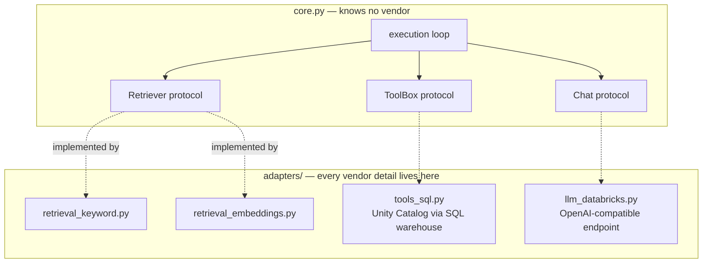

# Lab 2A — An Agent That Needs Two Sources to Answer

**Session 2 · Platform-Agnostic Agent Implementation**

> ✅ **Tested end-to-end.** The agent answers a question that **neither source can answer alone**: the order record says who placed it and therefore which region, and the policy document says the delivery window for that region. Run live against `databricks-claude-sonnet-5` with documents and orders in Unity Catalog.

## What you'll learn

- How to structure an agent so the **core logic depends on interfaces**, not on a vendor — the thing that makes Lab 2B's swap a one-line change.
- How a **retrieval** call and a **structured data** call combine in a single turn, and how to prove the agent used both.
- Why **citations** are a design requirement, not a nicety.
- How metadata on your documents (`audience: customer | agent_only`) becomes a **filter** the agent must respect.

## What you'll do

You'll run an agent against a question about a specific order. Watch it call two different tools, then answer using facts from both. Then you'll look at the code and find the seam that Lab 2B exploits.

## Time & cost

- **Time:** ~30 minutes.
- **Cost:** pennies for the model calls, plus a serverless SQL warehouse running for a few minutes.

---

## Before you start

- **Tools:** Python 3.10+, `pip install openai databricks-sdk`.
- **Compute:** a **serverless SQL warehouse** (the tool adapter queries Unity Catalog through it).
- **Data:** the shared retail dataset. Create it once with:
  ```bash
  python tools/run_sql.py tools/setup/01_seed_retail.sql
  python tools/run_sql.py tools/setup/02_load_retail.sql
  python tools/run_sql.py tools/setup/03_load_docs.sql
  ```
- **Environment:**
  ```bash
  export DATABRICKS_PROFILE=your-profile
  export LAB_WAREHOUSE_ID=<your serverless warehouse id>
  ```
- **Prior labs:** [Lab 1B](../session-1-agent-architecture/lab-1b-minimal-agent.md) — the loop here is the same one, with two sources instead of one.

---

## The idea in 60 seconds

Most real questions are not answerable from one place. *"How long should my desk take?"* needs a **policy** (delivery windows by region) and a **fact** (which region this particular order is going to). The agent's job is to notice that and fetch both.

The design that makes this portable is a hard line between the **core** and the **adapters**:



`core.py` imports nothing from Databricks. That is not decoration — it is the property Lab 2B measures.

---

## Step 1 — Ask the two-source question

**Goal:** see both sources used in a single turn.

```bash
python code/run.py --retrieval keyword
```

The question is chosen so that neither half suffices:

> *"My order ORD-1044 hasn't arrived yet. How long should a standing desk take to reach me, and is that normal?"*

**What you should see:**

```console
=== retrieval adapter: keyword-tfidf | model: databricks-claude-sonnet-5 ===

  step 1: get_order({"order_id": "ORD-1044"}) -> {"order_id": "ORD-1044", "status": "delivered", ...
  step 1: search_policy('standing desk delivery time') -> ['DOC-003', 'DOC-001', 'DOC-004']
  step 2: answer

  sources used: retrieval=['DOC-001', 'DOC-003', 'DOC-004'] tools=['get_order']
```

And the answer:

> Regarding delivery timing for reference: your order is shipping to the **Nordics** region, and per our delivery policy **[DOC-003]**, standard delivery to the Nordics takes **5 to 7 working days**, since shipments are consolidated at our Hamburg hub before onward transport.

**What this means.** The word *"Nordics"* appears nowhere in the question. The agent got it by looking up `ORD-1044`, which joins to customer `CUST-003` (Helsinki Works), whose region is Nordics. It then retrieved the policy that has a Nordics-specific window. **Remove either source and the answer is impossible** — that is the test this lab exists to pass.

> 💡 **Both tool calls came back in the same step.** The model asked for `get_order` *and* `search_policy` in one response. That is parallel tool calling, and it is why the answer took two model round-trips rather than three. You get it for free when the calls are independent; you do not get it when one call's arguments depend on the other's result.

---

## Step 2 — Prove it used both, not just one

**Goal:** never take "it answered correctly" as evidence that it worked correctly.

The runner tracks every source touched:

```python
used = {"retrieval": [], "tools": []}
...
used["retrieval"] += [h["doc_id"] for h in hits]
used["tools"].append(name)
```

```console
  sources used: retrieval=['DOC-001', 'DOC-003', 'DOC-004'] tools=['get_order']
```

**What this means.** A plausible answer can come from the model's own prior knowledge rather than from your data. An office furniture retailer's Nordics delivery window is not general knowledge, so a correct answer here is strong evidence — but *strong evidence* is not proof, and on a question the model could have guessed you would have none. Instrument the sources.

> ⚠️ **Gotcha — a citation is only as trustworthy as the retrieval behind it.** The model produced `[DOC-003]` because DOC-003 was in its context. Nothing forces the citation to match what it actually relied on. Cross-check the cited ids against the `used` list, which comes from your code rather than the model's output. In Lab 3B, MLflow tracing makes this check automatic.

---

## Step 3 — Find the seam

**Goal:** locate the exactly-one line Lab 2B will change.

Open [`code/run.py`](code/run.py):

```python
RETRIEVERS = {"keyword": KeywordRetriever, "embeddings": EmbeddingRetriever}
...
retriever = RETRIEVERS[a.retrieval]()
out = run(a.question, chat=chat, retriever=retriever, tools=tools)
```

And the contract they both satisfy, in [`code/core.py`](code/core.py):

```python
class Retriever(Protocol):
    def search(self, query: str, k: int = 3, **filters) -> list[dict]:
        """Return [{'doc_id','title','text','score'}, ...] most relevant first."""
    @property
    def name(self) -> str: ...
```

**What this means.** The core asks for *"documents most relevant to this string"*. It does not ask for an index, an embedding model, or a vector store — all of which are one adapter's private business. Anything satisfying four keys and a sort order can be dropped in.

> ⚠️ **Gotcha — the filter argument is where portability usually breaks.** `search(query, k, **filters)` passes `audience="customer"` through. The keyword adapter implements that as a Python `if`; a vector database implements it as a native filter expression with its own syntax; some backends cannot filter at all and force you to over-fetch and post-filter. Decide what your filter contract is **before** you write the second adapter, or the second adapter will quietly change behaviour. Lab 3A meets the Databricks Vector Search version of exactly this.

---

## Step 4 — Confirm the audience filter is real

**Goal:** check that a customer-facing question cannot reach internal-only policy.

Two of the seven documents are `agent_only`, including **DOC-006 — Refund authority limits**, which states the £50 approval threshold. A customer must never be shown it.

```bash
python code/compare_retrievers.py
```

```console
query: 'how much can I refund without asking anyone'   (audience=agent_only)
  keyword-tfidf            DOC-002(0.219), DOC-006(0.208)
  databricks-embeddings    DOC-006(0.668), DOC-002(0.491)
```

Only two documents come back, because only two are `agent_only`. The default in `core.py` is `audience="customer"`, so customer questions never see either.

**What this means.** The filter is applied **in the adapter, before results reach the model**. Filtering after the model has seen the text is not filtering. This is the same principle as Lab 1B's approval gate: the control lives in code, at the point of access.

---

## Step 5 — Clean up

```bash
# stop the warehouse if you started it only for this lab
databricks warehouses stop $LAB_WAREHOUSE_ID
```

The tables stay — Labs 2B and every Databricks session reuse them.

---

## What you learned

| You saw… | in Step | proof |
|---|---|---|
| A real question can need retrieval **and** live data | 1 | "Nordics" came from the order; "5–7 days" came from DOC-003 |
| Independent tool calls run in parallel | 1 | both calls in `step 1`, two model round-trips total |
| Instrument sources rather than trusting the answer | 2 | `used={'retrieval': [...], 'tools': [...]}` from your code |
| A citation is the model's claim, not your evidence | 2 gotcha | cross-check cited ids against `used` |
| The core depends on a Protocol, never a vendor | 3 | `core.py` imports nothing from Databricks |
| Filters belong in the adapter, before the model | 4 | `agent_only` docs never enter a customer turn |

## Evidence

[`artifacts/lab-2a/evidence/lab-2a-two-sources.txt`](../artifacts/lab-2a/evidence/lab-2a-two-sources.txt) — full run.
Source: [`code/core.py`](code/core.py), [`code/adapters/`](code/adapters/).

---

**Next:** [Lab 2B — Swap the Retrieval Backend Without Touching the Agent](lab-2b-adapter-swap.md)
