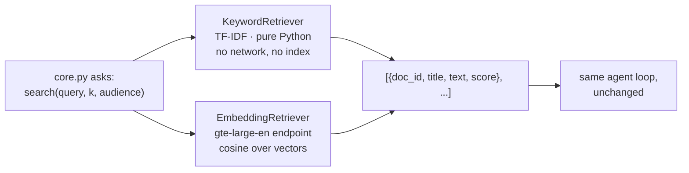

# Lab 2B — Swap the Retrieval Backend Without Touching the Agent

**Session 2 · Platform-Agnostic Agent Implementation**

> ✅ **Tested end-to-end.** The same question gets an equivalent, correctly-cited answer from two completely different retrieval backends — a pure-Python keyword scorer and a Databricks embeddings endpoint — with **no change to `core.py`, the tools, or the model**. The measured ranking differences, and the fact that they did *not* change the answer, are the most useful part of this lab.

## What you'll learn

- What "portable" actually buys you, demonstrated rather than asserted.
- Where portability **leaks**: authentication, filter semantics, and score scales that are not comparable.
- Why a better retriever can look identical from the outside — and why that is an argument for Session 6's evaluation, not against better retrieval.
- How to compare two retrievers honestly, on ranked results rather than on vibes.

## What you'll do

Run the Lab 2A agent again with one flag changed. Confirm the answer still holds. Then compare the two adapters directly on three queries and find the case where one is clearly better — and the reason the agent survived it anyway.

## Time & cost

- **Time:** ~25 minutes.
- **Cost:** pennies. The embedding adapter embeds seven short documents once per process.

---

## Before you start

- **Prior labs:** [Lab 2A](lab-2a-retrieval-and-tools.md). Same environment, same data, same commands.
- Confirm an embeddings endpoint exists in your workspace:
  ```bash
  databricks serving-endpoints list | grep -iE "gte|bge|embed"
  ```
  The adapter defaults to `databricks-gte-large-en`; override with `LAB_EMBED_MODEL`.

---

## The idea in 60 seconds

Two adapters, one interface. `KeywordRetriever` computes TF-IDF cosine in pure Python with no index and no network. `EmbeddingRetriever` calls a Databricks embeddings endpoint and ranks by vector cosine. They share nothing except four dictionary keys and a sort order.



---

## Step 1 — Make the swap

**Goal:** change the backend and nothing else.

```bash
python code/run.py --retrieval keyword      # Lab 2A
python code/run.py --retrieval embeddings   # this lab
```

That flag selects a class. Nothing else differs:

```python
RETRIEVERS = {"keyword": KeywordRetriever, "embeddings": EmbeddingRetriever}
retriever = RETRIEVERS[a.retrieval]()
```

**What you should see** — same question, different backend, same substance:

```console
=== retrieval adapter: databricks-embeddings | model: databricks-claude-sonnet-5 ===

  step 1: search_policy('standing desk delivery time') -> ['DOC-003', 'DOC-004', 'DOC-007']
  step 2: answer

  sources used: retrieval=['DOC-003', 'DOC-004', 'DOC-007'] tools=['get_order']
```

> Regarding delivery timing: for the Nordics region, standard delivery takes **5 to 7 working days**, since shipments are consolidated at the Hamburg hub before onward transport **[DOC-003]**.

**What this means.** Same region, same window, same citation. `core.py` was not edited, recompiled or reconfigured. **That is the deliverable of this lab** — portability shown, not claimed.

> ⚠️ **Gotcha — note what did *not* stay the same.** Adapter A returned `DOC-003, DOC-001, DOC-004`; adapter B returned `DOC-003, DOC-004, DOC-007`. Only rank 1 agrees. The answer survived because rank 1 was right in both cases and the model only needed that one. A question where the answer lived at rank 2 could have gone differently. **"The answer matched" is a weaker result than it looks.**

---

## Step 2 — Compare the retrievers honestly

**Goal:** stop eyeballing answers and look at ranked results.

```bash
python code/compare_retrievers.py
```

**What you should see:**

```console
query: 'standing desk delivery time'   (audience=customer)
  keyword-tfidf            DOC-003(0.482), DOC-001(0.143), DOC-004(0.000)
  databricks-embeddings    DOC-003(0.628), DOC-004(0.580), DOC-007(0.573)

query: 'can I send it back after six weeks'   (audience=customer)
  keyword-tfidf            DOC-005(0.194), DOC-007(0.164), DOC-003(0.040)
  databricks-embeddings    DOC-001(0.600), DOC-007(0.543), DOC-003(0.452)

query: 'how much can I refund without asking anyone'   (audience=agent_only)
  keyword-tfidf            DOC-002(0.219), DOC-006(0.208)
  databricks-embeddings    DOC-006(0.668), DOC-002(0.491)
```

**Read the second query carefully.** *"Can I send it back after six weeks"* is a returns question. The correct document is **DOC-001, the returns and refunds policy**, which sets a 30-day window with a 60-day extension for seating.

- The keyword adapter ranks **DOC-005 — Billing and payment terms** first. It is not about returns at all.
- The embedding adapter ranks **DOC-001** first, correctly.

The keyword adapter fails because the customer said *"send it back"* and the document says *"return"*. **Zero shared words, so zero lexical score.** The third query shows the same pattern: *"without asking anyone"* versus *"without approval"*.

> 💡 **This is the case for embeddings, stated in one line.** Lexical retrieval matches the words the user typed. Dense retrieval matches what they meant. Customers do not use your documentation's vocabulary.

---

## Step 3 — The uncomfortable part: run the bad case end to end

**Goal:** find out whether that retrieval failure actually reaches the customer.

```bash
python code/run.py --retrieval keyword \
  --question "I bought 30 ergonomic chairs six weeks ago for an office fit-out. Can I still send them back?"
```

Given Step 2, you would expect the keyword adapter to answer badly. **It does not:**

> Seating products and fit-out orders get an **extended 60-day return window** (vs. the standard 30 days) … Six weeks (42 days) is well within that 60-day window.

Correct, and it matches the embeddings run.

**Why it survived.** The agent does not pass the customer's words to the retriever. It writes its *own* query first — something closer to *"return policy fit-out seating"* — which shares vocabulary with the documents. The model's rephrasing repaired the retriever's weakness. `k=3` then gave it three chances rather than one.

> 🚨 **The lesson worth taking from this lab, and it is not the one the title suggests.** Two backends with a **measurable** quality gap produced the **same** answers on the questions we tried. If you judge retrieval by reading answers, you will conclude the cheaper adapter is fine — and you will be wrong in a way that only shows up on the queries you did not try. Comparing *ranked retrieval results* found the gap in seconds; comparing *answers* hid it completely.
>
> This is precisely why [Session 6](../session-6-evaluation-and-deployment/lab-6a-evaluation-dataset.md) builds an evaluation dataset with expected retrievals, instead of a demo script with three questions.

---

## Step 4 — Where portability actually leaks

**Goal:** know the three places the interface does not save you.

**1. Scores are not comparable.** TF-IDF cosine produced `0.482`; embedding cosine produced `0.628`. Both are "cosine" and neither means the same thing. **Never hardcode a relevance threshold that survives an adapter swap** — `score > 0.4` is a different filter on each backend. Rank, don't threshold, unless you recalibrate.

**2. Filters are the least portable thing you own.** `audience="customer"` is a Python `if` in the keyword adapter. In Databricks Vector Search it is a `filters` argument with its own syntax; in another store it is a metadata predicate language; in a third it does not exist and you must over-fetch and post-filter. The interface passed `**filters` through happily, and each adapter meant something different by it.

**3. Authentication moved, and the core never knew.** The keyword adapter needs no credentials. The embedding adapter needs a workspace token. Both got it from `lab_common.py`, never from `core.py`:

```python
def bearer_token() -> str:
    # oauth_token() raises under azure-cli auth, so read the header the SDK would send
    return workspace().config.authenticate()["Authorization"].removeprefix("Bearer ")
```

> ⚠️ **Gotcha — `config.oauth_token()` raises under Azure CLI auth.** `ValueError: OAuth tokens are not available for azure-cli authentication.` The header-reading form above works across every auth type Databricks supports, which is what you want in a lab that runs on both a laptop and a notebook.

---

## Step 5 — Clean up

Nothing to remove. No index was built; the embedding adapter holds its vectors in memory for the life of the process.

---

## What you learned

| You saw… | in Step | proof |
|---|---|---|
| A backend swap is one line when the core is protocol-bound | 1 | `--retrieval` flag; `core.py` untouched |
| Equivalent answers from completely different retrieval | 1 | same Nordics window, same `[DOC-003]` |
| Equivalent answers hide non-equivalent retrieval | 1 gotcha | only rank 1 agreed between adapters |
| Lexical retrieval fails on paraphrase | 2 | "send it back" → billing doc ranked first |
| Dense retrieval fixes it | 2 | same query → DOC-001 at 0.600 |
| The agent's own rephrasing can mask a bad retriever | 3 | keyword adapter still answered correctly |
| Judging retrieval by answers is unsound | 3 | measurable gap, identical outputs |
| Scores don't transfer across adapters | 4 | 0.482 vs 0.628, both "cosine" |
| Filter semantics are the real portability tax | 4 | `if` vs native filter vs unsupported |

## Evidence

[`artifacts/lab-2b/evidence/lab-2b-adapter-swap.txt`](../artifacts/lab-2b/evidence/lab-2b-adapter-swap.txt) — the swapped run and the side-by-side comparison.

---

**Next:** [Lab 3A — Build a Vector Search Index and Prove It Retrieves](../session-3-grounding-and-rag/lab-3a-vector-search-index.md) — the same retrieval problem, now with a real index, real chunking, and Databricks-native metadata filters.
