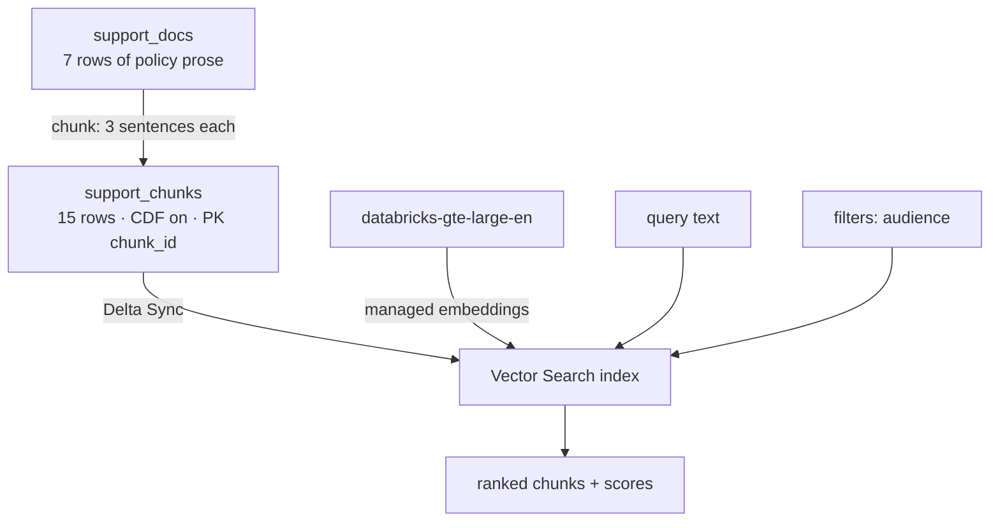
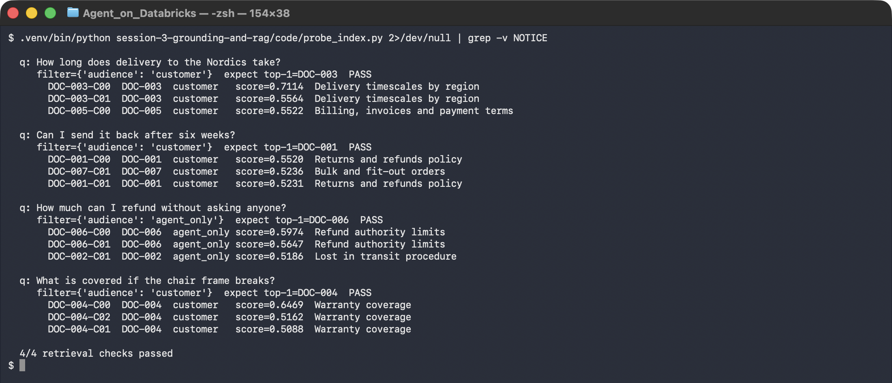

# Lab 3A — Build a Vector Search Index and Prove It Retrieves

**Session 3 · Introducing Databricks; Data Grounding and Agent Construction**

> ✅ **Tested end-to-end** on Azure Databricks (`eastus`). A Delta Sync index over 15 chunks with managed embeddings from `databricks-gte-large-en`, verified with **4/4 known-answer retrieval checks** including a metadata filter that keeps internal-only policy away from customer questions. No agent is built here — the index is proven working first, on purpose.

## What you'll learn

- How to prepare Delta data for retrieval: **chunking**, metadata, and the two table properties Vector Search insists on.
- The difference between a **Delta Sync** index (Databricks computes and refreshes embeddings) and a Direct Vector Access index, and why Delta Sync is almost always what you want.
- How **metadata filters** work in Vector Search, and why a filter is a governance control rather than a search refinement.
- How to spot-check retrieval with **known-answer queries** before any agent depends on it.
- What a `TRIGGERED` pipeline means for data freshness, and when it will embarrass you.

## What you'll do

Chunk seven policy documents into a Delta table, enable Change Data Feed, add a primary key, build a Delta Sync index, and then run four queries whose correct answers you already know. Only when those pass do you move on.

## Time & cost

- **Time:** ~40 minutes, most of it waiting for the index to provision.
- **Cost:** a Vector Search endpoint while it exists, plus a serverless SQL warehouse for the chunking. Delete the endpoint when done — see Step 6.

---

## Before you start

- **Tools:** `pip install databricks-ai-search databricks-sdk`.
- **Compute:** a serverless SQL warehouse, and permission to create a Vector Search endpoint.
- **Data:** the shared retail dataset from `tools/setup/01–03`.
- **Environment:**
  ```bash
  export DATABRICKS_PROFILE=your-profile
  export LAB_WAREHOUSE_ID=<serverless warehouse id>
  ```

> ⚠️ **Gotcha — the package was renamed.** `databricks-vectorsearch` still installs and still works, but importing it prints:
> ```
> DeprecationWarning: databricks-vectorsearch is deprecated and has been renamed to
> databricks-ai-search. Imports under 'databricks.vector_search.*' will continue to work
> as a thin re-export of 'databricks.ai_search.*'
> ```
> Most tutorials you will find still use the old name. Use `databricks-ai-search` and `from databricks.ai_search.client import VectorSearchClient`.

---

## The idea in 60 seconds

Vector Search does not index your table. It indexes a **column of text**, keyed by a primary key, and keeps itself in step with the source Delta table through Change Data Feed.



**Managed embeddings** is the part worth noticing: you name an embedding endpoint and Databricks embeds both the source column and every query. You never store a vector yourself.

---

## Step 1 — Chunk, and carry the metadata with you

**Goal:** turn seven documents into retrievable units without losing what governs them.

```bash
python tools/run_sql.py tools/setup/04_chunk_docs.sql
```

The chunking is sentence-aware, three sentences per chunk:

```sql
LATERAL VIEW posexplode(split(body, '(?<=\\.)\\s+')) t AS pos, sentence
...
CAST(pos / 3 AS INT) AS grp
```

**What you should see:**

```console
  [1/5] ok   CREATE OR REPLACE TABLE agents_labs.retail.support_chunks AS WITH senten
  [5/5] ok   SELECT doc_id, count(*) AS chunks, round(avg(length(chunk))) AS avg_char
         DOC-001 | 2 | 373.0
         DOC-002 | 2 | 332.0
         DOC-003 | 2 | 244.0
         DOC-004 | 3 | 186.0
         DOC-005 | 2 | 245.0
         DOC-006 | 2 | 273.0
         DOC-007 | 2 | 223.0
```

**What this means.** `doc_id`, `category` and **`audience`** are carried onto every chunk. A chunk that loses its `audience` cannot be filtered, and an internal-only refund limit becomes retrievable by a customer. **Metadata is not decoration; it is the unit of governance.**

> ⚠️ **Gotcha — chunk on sentence boundaries, not character counts.** A fixed 500-character split will cut *"Refunds of 50 GBP and above require approval from a supervisor"* in half and produce a chunk that says refunds require approval, and another that says 50 GBP. Both are retrievable. Both are wrong.

---

## Step 2 — The two properties Vector Search requires

**Goal:** understand why a source table needs preparing at all.

```sql
ALTER TABLE agents_labs.retail.support_chunks
  SET TBLPROPERTIES (delta.enableChangeDataFeed = true);

ALTER TABLE agents_labs.retail.support_chunks ALTER COLUMN chunk_id SET NOT NULL;
ALTER TABLE agents_labs.retail.support_chunks ADD CONSTRAINT support_chunks_pk PRIMARY KEY (chunk_id);
```

**What this means.**

- **Change Data Feed** is how Delta Sync knows what changed. Without it the index has no way to refresh incrementally and creation fails.
- The **primary key** is the identity Vector Search returns and updates against. It must be `NOT NULL` *before* the constraint can be added — hence two statements, in that order.

> ⚠️ **Gotcha — `ALTER COLUMN ... SET NOT NULL` must come first.** Adding the primary key constraint to a nullable column fails, and the error talks about the constraint rather than the nullability, which sends people to the wrong place.

---

## Step 3 — Create the endpoint and the Delta Sync index

**Goal:** build the index, and understand what `TRIGGERED` commits you to.

```bash
databricks vector-search-endpoints create-endpoint agents-labs-vs STANDARD
```

```python
from databricks.ai_search.client import VectorSearchClient

vsc = VectorSearchClient(workspace_url=host, personal_access_token=token, disable_notice=True)
vsc.create_delta_sync_index(
    endpoint_name="agents-labs-vs",
    index_name="agents_labs.retail.support_chunks_idx",
    source_table_name="agents_labs.retail.support_chunks",
    pipeline_type="TRIGGERED",
    primary_key="chunk_id",
    embedding_source_column="chunk",
    embedding_model_endpoint_name="databricks-gte-large-en",
)
```

Poll until it is ready:

```python
st = vsc.get_index(index_name=IDX).describe()["status"]
print(st["ready"], st["detailed_state"], st["indexed_row_count"])
```

**What you should see**, eventually:

```console
  ready: True | state: ONLINE_NO_PENDING_UPDATE | rows: 15
```

> ⚠️ **Gotcha — `endpoint_status: ONLINE` does not mean the index is usable.** The endpoint reported `ONLINE` within seconds of creation, while the index sat at `PROVISIONING_ENDPOINT` for roughly **20 minutes**. Two different objects, two different readiness signals. Poll the *index*, and do not put endpoint creation in the critical path of a timed lab session — create it before the room arrives.

> ⚠️ **Gotcha — `TRIGGERED` means stale until you say otherwise.** A triggered pipeline embeds what exists at creation and then does nothing until you call `index.sync()`. Edit a policy document and the index keeps serving the old text, silently and indefinitely. `CONTINUOUS` keeps up automatically at the cost of always-on compute. Pick deliberately; the default will not warn you.

---

## Step 4 — Prove it retrieves, with known answers

**Goal:** never build an agent on an unverified index.

```bash
python code/probe_index.py
```

Four queries whose correct top hit is known in advance:

| Query | Filter | Expected top-1 |
|---|---|---|
| How long does delivery to the Nordics take? | `customer` | DOC-003 |
| Can I send it back after six weeks? | `customer` | DOC-001 |
| How much can I refund without asking anyone? | `agent_only` | DOC-006 |
| What is covered if the chair frame breaks? | `customer` | DOC-004 |

**What you should see:**



```console
  q: Can I send it back after six weeks?
     filter={'audience': 'customer'}  expect top-1=DOC-001  PASS
       DOC-001-C00  DOC-001  customer   score=0.5520  Returns and refunds policy
       DOC-007-C01  DOC-007  customer   score=0.5236  Bulk and fit-out orders
       DOC-001-C01  DOC-001  customer   score=0.5231  Returns and refunds policy

  4/4 retrieval checks passed
```

**What this means.** Note the second query — *"send it back"* against a document that says *"return"*. This is the exact paraphrase that defeated the keyword retriever in [Lab 2B](../session-2-platform-agnostic/lab-2b-adapter-swap.md), and the managed embeddings handle it. That is the concrete reason to pay for an index rather than grep.

---

## Step 5 — The filter is a governance boundary

**Goal:** see that `audience` keeps internal policy out of customer answers.

```console
  q: How much can I refund without asking anyone?
     filter={'audience': 'agent_only'}  expect top-1=DOC-006  PASS
       DOC-006-C00  DOC-006  agent_only score=0.5974  Refund authority limits
       DOC-006-C01  DOC-006  agent_only score=0.5647  Refund authority limits
       DOC-002-C01  DOC-002  agent_only score=0.5186  Lost in transit procedure
```

Every hit is `agent_only`. Run the same query with `audience="customer"` and DOC-006 cannot appear at all.

**What this means.** DOC-006 states the £50 approval threshold — the rule [Lab 1B](../session-1-agent-architecture/lab-1b-minimal-agent.md) enforces in code. A customer who learns the threshold learns exactly how to structure a request to stay under it. The filter is applied **inside Vector Search, before results exist**, which is the only place it counts.

> 🚨 **Gotcha — a filter you pass optionally is not a control.** In this lab the default is `{"audience": "customer"}` and the caller must deliberately ask for `agent_only`. If your retrieval helper makes the filter an optional argument that defaults to *no filter*, then every forgotten filter is a disclosure. Default to the restrictive case and make the permissive one explicit.

---

## Step 6 — Clean up

```bash
databricks vector-search-endpoints delete-endpoint agents-labs-vs
```

The endpoint is the part that costs money while idle. The Delta tables are reused by every later lab — leave them.

---

## What you learned

| You saw… | in Step | proof |
|---|---|---|
| Chunks must carry the metadata that governs them | 1 | `audience` on all 15 chunks |
| Sentence-aware chunking avoids splitting a rule in half | 1 gotcha | 3-sentence groups, not fixed characters |
| Delta Sync needs CDF and a non-null primary key | 2 | two `ALTER`s, in that order |
| Endpoint readiness ≠ index readiness | 3 gotcha | endpoint `ONLINE` in seconds, index ~20 min |
| `TRIGGERED` leaves the index stale until synced | 3 gotcha | no refresh without `index.sync()` |
| Retrieval is verified with known answers, not vibes | 4 | 4/4 passed, scores shown |
| Embeddings solve the paraphrase that beat keywords | 4 | "send it back" → DOC-001 |
| The filter is where governance is enforced | 5 | `agent_only` results only |

## Evidence

[`artifacts/lab-3a/evidence/lab-3a-index-and-retrieval.txt`](../artifacts/lab-3a/evidence/lab-3a-index-and-retrieval.txt) — chunk build and all four checks.
Source: [`code/probe_index.py`](code/probe_index.py), [`tools/setup/04_chunk_docs.sql`](../tools/setup/04_chunk_docs.sql).

---

**Next:** [Lab 3B — Make the Retrieval Auditable with MLflow Tracing](lab-3b-traced-rag-agent.md)
