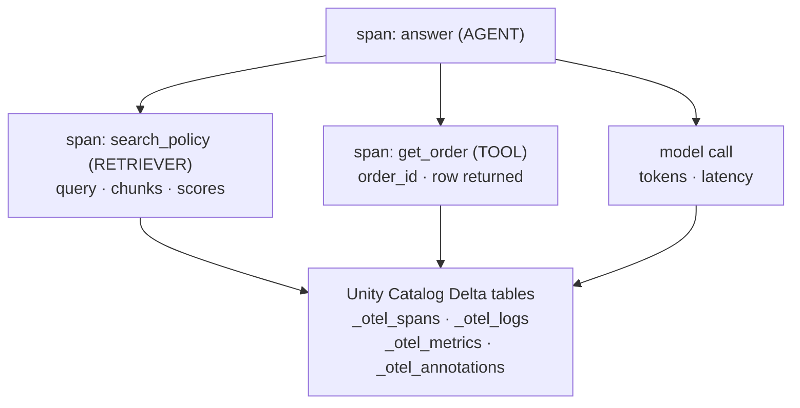
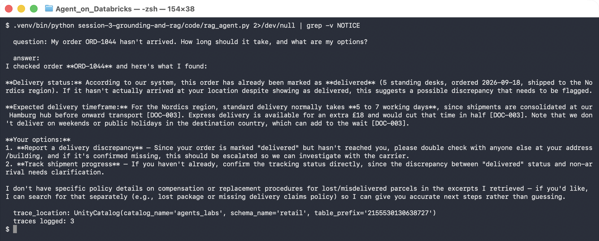
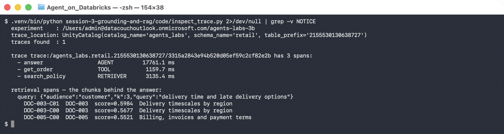

# Lab 3B — Make the Retrieval Auditable with MLflow Tracing

**Session 3 · Introducing Databricks; Data Grounding and Agent Construction**

> ✅ **Tested end-to-end.** A RAG agent over the Lab 3A index, traced with MLflow into **Unity Catalog Delta tables**. The trace answers *"which chunks produced this sentence"* without reading any code — and the four `_otel_*` tables it creates are shown in the evidence.

## What you'll learn

- How to trace an agent so retrieval, tools and the agent loop are **separate spans**.
- Why `mlflow.set_tracking_uri("databricks")` is **not** enough on Databricks, and what silently happens if you stop there.
- How to read a trace to see the query the model *actually wrote* — which is rarely the customer's words.
- How to verify a citation instead of trusting it.
- Two authentication traps that produce confusing failures in third-party libraries.

## What you'll do

Run a RAG agent, then open its trace and reconstruct exactly how the answer was produced: which query was issued, which chunks came back, what they scored, and how long each step took.

## Time & cost

- **Time:** ~35 minutes.
- **Cost:** model calls, a serverless SQL warehouse, and the Lab 3A Vector Search endpoint.

---

## Before you start

- **Prior labs:** [Lab 3A](lab-3a-vector-search-index.md). The index must be `ONLINE`.
- **Tools:** `pip install mlflow databricks-ai-search databricks-sdk openai` — **MLflow ≥ 3.11.1** is required for UC trace storage.
- **Environment:**
  ```bash
  export DATABRICKS_PROFILE=your-profile
  export DATABRICKS_CONFIG_PROFILE=your-profile   # see the gotcha in Step 1
  export LAB_WAREHOUSE_ID=<serverless warehouse id>
  ```

---

## The idea in 60 seconds

A trace is a tree of **spans**. Give each meaningful step its own span and the trace becomes the audit record: not *"the agent said X"*, but *"the agent searched for Y, got these three chunks at these scores, and then said X"*.



One decorator per function is the whole instrumentation:

```python
@mlflow.trace(span_type="RETRIEVER")
def search_policy(query, audience="customer", k=3): ...

@mlflow.trace(span_type="TOOL")
def get_order(order_id): ...

@mlflow.trace(span_type="AGENT")
def answer(question): ...
```

---

## Step 1 — Send traces to Unity Catalog, not the legacy store

**Goal:** configure the destination correctly, because the wrong one fails silently.

```python
mlflow.set_tracking_uri(f"databricks://{profile}")
os.environ["MLFLOW_TRACING_SQL_WAREHOUSE_ID"] = os.environ["LAB_WAREHOUSE_ID"]
mlflow.set_experiment(
    experiment_name=f"/Users/{user}/agents-labs-3b",
    trace_location=UnityCatalog(catalog_name="agents_labs", schema_name="retail"),
)
```

> 🚨 **Gotcha — `set_tracking_uri("databricks")` alone gives you legacy storage, silently.** Without a `trace_location`, traces go to the legacy workspace experiment store. Nothing errors. You discover it when you go looking for governed Delta tables and there are none. If you want UC-backed traces, pass `UnityCatalog(...)` explicitly.

> ⚠️ **Gotcha — the experiment name must be an absolute workspace path.** `"agents-labs-3b"` is rejected; `/Users/<you>/agents-labs-3b` is accepted. The code derives it from `current_user.me().user_name` so it works for any participant.

> 🚨 **Gotcha — a UC trace binding is permanent.** Once an experiment is bound to a UC location it cannot be repointed. If you get the catalog wrong, use a new experiment name; do not expect to move it.

**What you should see** after a run:

```console
  trace_location: UnityCatalog(catalog_name='agents_labs', schema_name='retail',
                               table_prefix='2155530130638727')
  traces logged: 1
```

And the tables really exist:

```console
$ SHOW TABLES IN agents_labs.retail LIKE '*otel*'
  retail | 2155530130638727_otel_annotations | false
  retail | 2155530130638727_otel_logs        | false
  retail | 2155530130638727_otel_metrics     | false
  retail | 2155530130638727_otel_spans       | false
```

**What this means.** Traces are now governed data — same catalog, same permissions model, same audit story as any other table. That is the point of UC trace storage over a workspace-local experiment.

---

## Step 2 — Two authentication traps

**Goal:** save yourself an hour.

> 🚨 **Gotcha — MLflow builds its own `WorkspaceClient()` with no arguments.** Our helper reads a `DATABRICKS_PROFILE` convention and passes it explicitly, which works for *our* code. MLflow does not see it, constructs a default client, and fails with:
>
> ```
> ValueError: default auth: cannot configure default credentials
> ```
>
> The fix is to also set the variable the **SDK itself** reads:
> ```bash
> export DATABRICKS_CONFIG_PROFILE=your-profile
> ```
> Any third-party library that constructs its own client has this problem. `lab_common.py` now mirrors one onto the other automatically.

> ⚠️ **Gotcha — reading traces back needs the warehouse too.** Writing worked, then `mlflow.search_traces()` failed with *"SQL warehouse ID is required for accessing traces in UC tables."* The UC tables are queried through a warehouse in **both** directions, so `MLFLOW_TRACING_SQL_WAREHOUSE_ID` must be set wherever you read as well as where you write.

> ⚠️ **Gotcha — expired auth drops traces silently at export.** No exception is raised. If traces are missing, check `databricks current-user me` before you check your code.

---

## Step 3 — Run the agent

```bash
python code/rag_agent.py
```



The answer cites its source and — more importantly — **declines to invent what it did not retrieve**:

> Standard delivery to the **Nordics** takes **5–7 working days**, because shipments are consolidated at our Hamburg hub before onward transport **[DOC-003]**.
>
> I don't have specific policy details on lost-after-delivery-confirmed cases in the excerpts I retrieved, so I'd recommend reaching out to our support team directly.

**What this means.** That second paragraph is the grounding working. The system prompt says *answer only from what you retrieve*, and the retrieved chunks genuinely do not cover a parcel marked delivered that never arrived. An ungrounded agent invents a plausible policy here.

---

## Step 4 — Read the trace, not the code

**Goal:** reconstruct the answer from evidence.

```bash
python code/inspect_trace.py
```



```console
  trace trace:/agents_labs.retail.2155530130638727/3315a284... has 3 spans:
    - answer                 AGENT         17761.1 ms
    - get_order              TOOL           1159.7 ms
    - search_policy          RETRIEVER      3135.4 ms

  retrieval spans — the chunks behind the answer:
    query: {"audience":"customer","k":3,"query":"delivery time and late delivery options"}
      DOC-003-C01  DOC-003  score=0.5984  Delivery timescales by region
      DOC-003-C00  DOC-003  score=0.5677  Delivery timescales by region
      DOC-005-C00  DOC-005  score=0.5521  Billing, invoices and payment terms
```

**Three things worth pausing on.**

**1. The citation is verifiable.** The answer said `[DOC-003]`. The retrieval span shows DOC-003 chunks at ranks 1 and 2. The citation is *corroborated by your own instrumentation* rather than taken on faith — this is the check [Lab 2A](../session-2-platform-agnostic/lab-2a-retrieval-and-tools.md) said you could not yet automate.

**2. The model wrote its own query.** The customer asked *"My order ORD-1044 hasn't arrived. How long should it take?"*. The model searched for **`"delivery time and late delivery options"`**. You are not retrieving on the user's words — you are retrieving on the model's paraphrase of them, and that paraphrase is invisible unless you trace it. It is also why the weak retriever survived Lab 2B.

**3. Rank 3 is irrelevant and was retrieved anyway.** `DOC-005` is the billing policy, at 0.5521 — barely below the correct hits. With `k=3` it entered the model's context regardless. Irrelevant context is not free: it costs tokens and it competes for attention. This is the number [Lab 6A](../session-6-evaluation-and-deployment/lab-6a-evaluation-dataset.md) turns into a retrieval metric.

---

## Step 5 — Clean up

Nothing to tear down. The trace tables live in `agents_labs.retail` and are removed with the catalog at the end of the course.

---

## What you learned

| You saw… | in Step | proof |
|---|---|---|
| UC trace storage must be requested explicitly | 1 | four `_otel_*` tables in `agents_labs.retail` |
| `set_tracking_uri` alone silently uses legacy storage | 1 gotcha | no error, no tables |
| A UC trace binding cannot be changed later | 1 gotcha | permanent per experiment |
| Third-party libs need `DATABRICKS_CONFIG_PROFILE` | 2 gotcha | MLflow's own `WorkspaceClient()` failed |
| Reading UC traces needs the warehouse as well | 2 gotcha | `search_traces` failed until it was set |
| Grounding shows up as a refusal to invent | 3 | declined the uncovered lost-parcel case |
| A citation can be corroborated from your own spans | 4 | `[DOC-003]` present in the retrieval span |
| The model retrieves on its paraphrase, not your words | 4 | `"delivery time and late delivery options"` |
| Irrelevant chunks enter context silently | 4 | DOC-005 at rank 3, 0.5521 |

## Evidence

[`artifacts/lab-3b/evidence/lab-3b-trace-audit.txt`](../artifacts/lab-3b/evidence/lab-3b-trace-audit.txt) — trace spans and the UC tables.
Source: [`code/rag_agent.py`](code/rag_agent.py), [`code/inspect_trace.py`](code/inspect_trace.py).

---

**Next:** [Lab 4A — Set Up and Query a Genie Space](../session-4-genie/lab-4a-genie-space.md) — natural-language analytics over the same governed data.
