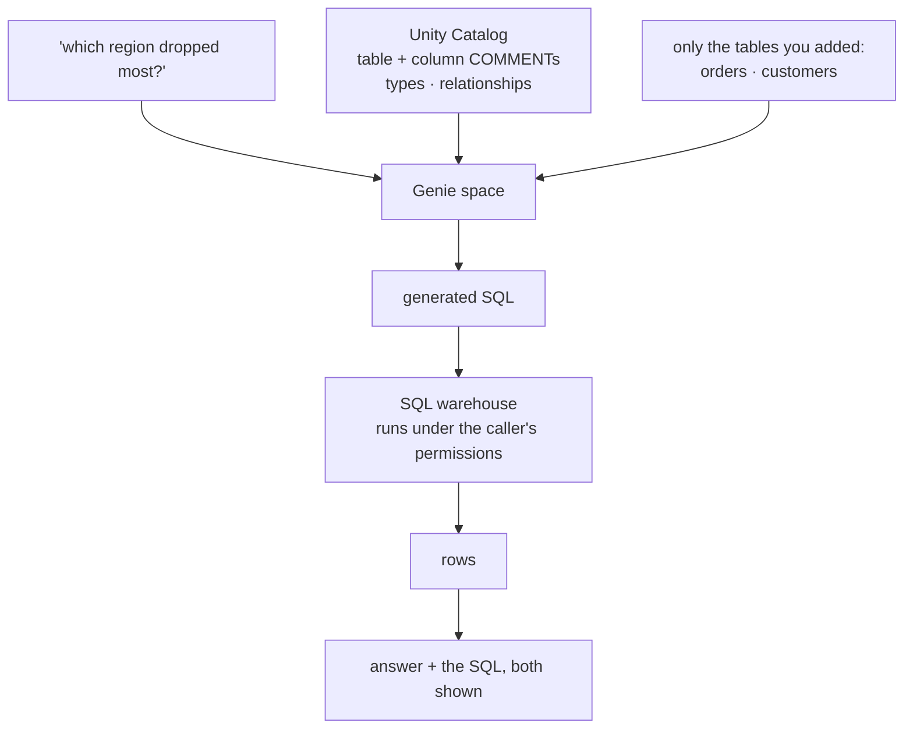
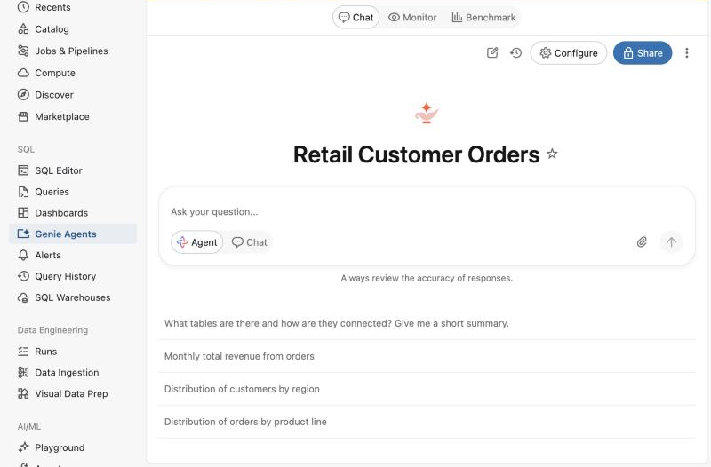

# Lab 4A — Set Up and Query a Genie Space

**Session 4 · Databricks Genie**

> ✅ **Tested end-to-end.** A Genie space over two governed Unity Catalog tables, asked a question no one wrote SQL for — *"which region had the biggest drop in revenue?"* — and it answered **Nordics, 22,020 → 4,678** with a windowed `RANK()` query it wrote itself. Then it drilled down to the single customer responsible.

## What you'll learn

- What a **Genie space** is: a governed natural-language interface over tables you choose, not a chatbot with database access.
- How Genie grounds itself in **Unity Catalog semantics** — and why your `COMMENT` text is doing more work than you think.
- Why you should read the **SQL Genie generated**, every time, before trusting the number.
- How a follow-up question narrows a finding from *"a region is down"* to *"this customer, this product line"*.
- Where Genie's honesty ends: it can tell you *what* changed, never *why*.

## What you'll do

Create a space over the retail tables, ask a business question in English, read the SQL it wrote, then ask a follow-up that drills into the cause.

## Time & cost

- **Time:** ~30 minutes.
- **Cost:** a serverless SQL warehouse for the duration.

---

## Before you start

- **Compute:** a **Pro or Serverless** SQL warehouse. Genie will not run on a classic warehouse.
- **Permissions:** `CAN USE` on the warehouse, and `SELECT` on the tables. Databricks Assistant must be enabled for the workspace.
- **Data:** `agents_labs.retail.orders` and `agents_labs.retail.customers`.

---

## The idea in 60 seconds

Genie is not "an LLM with a database connection". It is a **space**: a fixed set of tables, plus the semantics Unity Catalog already holds about them, plus any instructions you add. Questions are answered by generating SQL against exactly those tables and nothing else.



The governance property that matters: **the SQL runs as the person asking.** Genie cannot show a user data they could not already query.

---

## Step 1 — Create the space

**Goal:** a space scoped to two tables and nothing else.

In the workspace: **Genie Agents → + New**, search for `agents_labs`, select `orders` and `customers`, then **Create**.



Verify it from the CLI:

```bash
databricks genie get-space <space-id> -o json
```

```console
  title      : Retail Customer Orders
  space_id   : 01f1bc6b0a4f1c6d8269cc9c1ec2af08
  warehouse  : c8729519c456cb8e
```

> ⚠️ **Gotcha — space creation is a UI operation in practice.** There is a `databricks genie create-space` command, but it takes a `serialized_space` blob whose schema is only obtainable by exporting an existing space. Probing it returns `Invalid serialized_space: Unknown field 'title'` and similar for every reasonable guess. Create the first space in the UI; script later ones by exporting that one.

> 💡 **Your table comments are the grounding.** When you hover a table in the picker, Genie shows its Unity Catalog `COMMENT`. The `orders` table here says *"Retail orders. The structured half of the course: Genie queries this…"*, and every column carries a comment too. That text is what Genie reads to decide which column means "revenue" and which means "when it was ordered". **Undocumented tables make a poor Genie space**, and the fix is `COMMENT ON`, not prompt engineering.

---

## Step 2 — Ask a question nobody wrote SQL for

**Goal:** get a correct, governed answer from English.

```bash
python code/ask_genie.py
```

The question: *"Which region had the biggest drop in revenue from August to September 2026?"*


**What you should see** — Genie writes a windowed query, unprompted:

```sql
WITH region_revenue AS (
  SELECT c.region,
         SUM(CASE WHEN ... '2026-08' ... END) AS august_revenue,
         SUM(CASE WHEN ... '2026-09' ... END) AS september_revenue
  FROM agents_labs.retail.orders o
  INNER JOIN agents_labs.retail.customers c ON o.customer_id = c.customer_id
  WHERE o.order_date >= DATE'2026-08-01' AND o.order_date < DATE'2026-10-01'
  GROUP BY c.region
), ranked AS (
  SELECT region, august_revenue, september_revenue,
         (august_revenue - september_revenue) AS revenue_drop,
         RANK() OVER (ORDER BY (august_revenue - september_revenue) DESC) AS rnk
  FROM region_revenue
)
SELECT region, august_revenue, september_revenue, revenue_drop FROM ranked WHERE rnk <= 1
```

```console
  rows:
    {"region": "Nordics", "august_revenue": "22020.00",
     "september_revenue": "4678.00", "revenue_drop": "17342.00"}
```

> The **Nordics** region had the biggest revenue drop: August **22020.00**, September **4678.00**, a decline of **17342.00**.

**What this means.** The join, the conditional aggregation, the window function and the ranking were all inferred from the question and the table comments. Nobody wrote that SQL.

> 🚨 **Gotcha — always read the generated SQL.** It is returned alongside the answer for a reason. A plausible number computed from the wrong join, the wrong date boundary, or a silently dropped `NULL` is far more dangerous than an error. Here the `WHERE` uses a half-open range `>= '2026-08-01' AND < '2026-10-01'`, which is correct; a `BETWEEN` on a timestamp column would have been subtly wrong. **The SQL is the auditable artifact, not the prose.**

---

## Step 3 — Drill down to the cause

**Goal:** turn *"a region is down"* into something actionable.

```bash
python code/ask_genie.py "For the Nordics only, break September 2026 revenue down by customer and product line, and compare it to August."
```


```console
  {"customer_name": "Nordic Office Group", "product_line": "Seating",
   "august_2026_revenue": "16500.00", "september_2026_revenue": "0.00",
   "revenue_change_vs_august": "-16500.00"}
  {"customer_name": "Fjord Interiors",    "product_line": "Lighting", ... "-480.00"}
  {"customer_name": "Helsinki Works",     "product_line": "Desks",    ... "-540.00"}
```

**What this means.** Of a 17,342 drop, **16,500 is one customer in one product line**. The other Nordics customers are down by a few hundred — noise. This is the shape of a real analysis: the aggregate was a symptom, the breakdown is the finding.

> 💡 **This is [Lab 1A's scenario D](../session-1-agent-architecture/lab-1a-workflow-vs-agent.md), running for real.** That design exercise argued *"why did revenue drop in the Nordics?"* is genuinely agentic because each query's result determines the next. You have just done exactly that: the regional query told you *where* to look, and only then could you ask the breakdown question. Neither query was knowable in advance.

---

## Step 4 — Where Genie stops

**Goal:** know the boundary before you rely on it.

Genie answers questions about **what the data says**. It cannot tell you:

- **Why** Nordic Office Group stopped ordering. Intent is not in the orders table.
- Anything about tables **not in the space** — that is the governance boundary, and it is a feature.
- Anything from **documents**. Policy lives in prose, not columns; that is what [Lab 3A's](../session-3-grounding-and-rag/lab-3a-vector-search-index.md) index is for.

> ⚠️ **Gotcha — a confident answer over an incomplete space is still incomplete.** If you add `orders` but forget `customers`, Genie will happily answer regional questions by… not being able to, or by finding some other column that looks regional. It does not know what it is missing. **Scope the space deliberately, and test it with questions whose answers you already know** — the same discipline as Lab 3A's retrieval checks.

---

## Step 5 — Clean up

The space costs nothing when idle. Stop the warehouse if you started it for this lab:

```bash
databricks warehouses stop $LAB_WAREHOUSE_ID
```

---

## What you learned

| You saw… | in Step | proof |
|---|---|---|
| A Genie space is scoped to tables you choose | 1 | two tables, nothing else reachable |
| Unity Catalog comments are the grounding | 1 | column comments drive column selection |
| Space creation is realistically a UI task | 1 gotcha | `serialized_space` schema is not guessable |
| Genie writes non-trivial SQL from English | 2 | CTEs, conditional aggregation, `RANK()` |
| The generated SQL is the auditable artifact | 2 gotcha | half-open date range, visible and checkable |
| A follow-up turns a symptom into a finding | 3 | 16,500 of a 17,342 drop is one customer |
| Genie answers *what*, never *why* | 4 | intent is not a column |

## Evidence

[`artifacts/lab-4a/evidence/lab-4a-genie-answers.txt`](../artifacts/lab-4a/evidence/lab-4a-genie-answers.txt) — both questions, with generated SQL and rows.
Source: [`code/ask_genie.py`](code/ask_genie.py).

---

**Next:** [Lab 4B — Call Genie From Inside an Agent](lab-4b-genie-in-an-agent.md)
