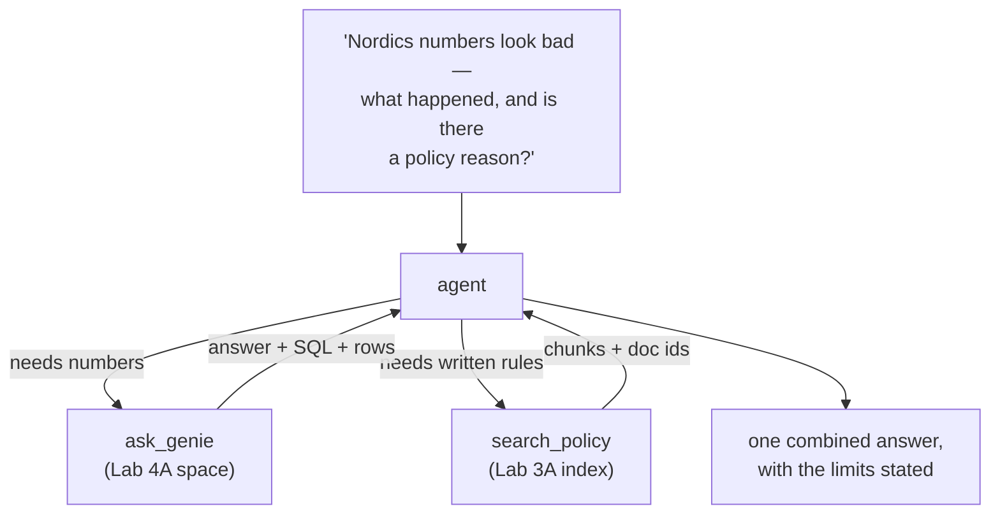
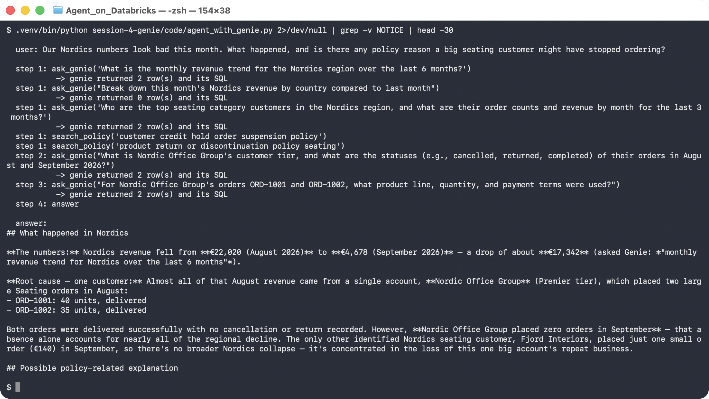

# Lab 4B — Call Genie From Inside an Agent

**Session 4 · Databricks Genie**

> ✅ **Tested end-to-end.** One vague business question — *"our Nordics numbers look bad, what happened, and is there a policy reason?"* — and the agent called **Genie twice for the numbers and the policy index once**, then combined them. It also did the thing that matters most: it said which part the data could not answer.

## What you'll learn

- How to expose a Genie space as **one tool among several**, so analytics stops being a place users visit.
- Why the tool description is the only thing steering the model toward Genie rather than guessing.
- How an agent chains Genie calls: the first answer determines the second question.
- What it looks like when an agent correctly refuses to infer intent from data.

## What you'll do

Give the Lab 3A policy index and the Lab 4A Genie space to one agent, ask a question that needs both, and watch the calls it makes.

## Time & cost

- **Time:** ~30 minutes.
- **Cost:** model calls, the Genie warehouse, and the Vector Search endpoint.

---

## Before you start

- **Prior labs:** [4A](lab-4a-genie-space.md) for the space, [3A](../session-3-grounding-and-rag/lab-3a-vector-search-index.md) for the index.
- **Environment:**
  ```bash
  export DATABRICKS_PROFILE=your-profile
  export DATABRICKS_CONFIG_PROFILE=your-profile
  export LAB_WAREHOUSE_ID=<warehouse id>
  export LAB_GENIE_SPACE=<space id from Lab 4A>
  ```

---

## The idea in 60 seconds

In Lab 4A a human asked Genie. Here the **model** asks Genie, having decided that the question needs numbers.



The Genie tool returns **the answer, the SQL and the rows**. Handing all three back into the conversation is deliberate: the model can quote the number, and you can audit where it came from.

---

## Step 1 — Wrap Genie as a tool

**Goal:** one function, one schema, one honest description.

```python
{"type": "function", "function": {
    "name": "ask_genie",
    "description": "Ask a natural-language analytics question over governed retail "
                   "orders and customers. Returns an answer plus the SQL Genie ran.",
    "parameters": {"type": "object",
                   "properties": {"question": {"type": "string"}},
                   "required": ["question"]}}}
```

And the system prompt does the steering:

```
Use ask_genie for numbers. Never invent a figure. When you quote a number,
say which question you asked Genie to get it.
```

**What this means.** The tool takes a *question*, not a SQL string and not parameters. That is the whole point of Genie-as-a-tool: the agent delegates the *translation* problem rather than trying to write SQL itself. Your agent never needs to know the schema.

> ⚠️ **Gotcha — without "use ask_genie for numbers", the model will guess.** A model asked about revenue will happily produce a confident, invented figure. The instruction plus a tool that can actually answer is what converts a guess into a lookup. Test this by removing the line — it is a five-second experiment that changes how seriously people take tool descriptions.

---

## Step 2 — Ask the vague question

**Goal:** watch the agent decompose it.

```bash
python code/agent_with_genie.py
```

> *"Our Nordics numbers look bad this month. What happened, and is there any policy reason a big seating customer might have stopped ordering?"*



**What you should see** — the tool calls, in order:

```console
  step 1: ask_genie('What was the total revenue for the Nordics region in August 2026
                     vs September 2026, broken down by customer?')
           -> genie returned 5 row(s) and its SQL
  step 2: ask_genie('Show all orders for Nordic Office Group with dates, product lines,
                     units and revenue')
           -> genie returned 2 row(s) and its SQL
  step 3: search_policy('fit-out order cancellation return policy seating bulk')
  step 4: answer
```

**What this means.** The second Genie question **did not exist** until the first one answered. Nothing in the user's message names *Nordic Office Group* — the agent learned that name from Genie, then went back to Genie about it. That is the chained, result-dependent behaviour [Lab 1A](../session-1-agent-architecture/lab-1a-workflow-vs-agent.md) classified as genuinely agentic, now happening on its own.

---

## Step 3 — Read the combined answer

**Goal:** see the two sources joined in one narrative.

> **The numbers (via Genie):** Nordics revenue fell from **22,020 (Aug)** to **4,678 (Sep)** — a **78.8%** drop. … The real story is **Nordic Office Group**: **16,500** in August (75% of that month's Nordics total) and **0** in September.
>
> **Policy angle (via search_policy):** Both August orders are over the 20-unit threshold, so each qualifies as a **fit-out order** (**DOC-007**). *"Cancellation of a fit-out order after production has begun incurs a 15 percent restocking charge"* — a plausible reason a large customer would pull back rather than place a third order.
>
> **Bottom line:** This isn't a broad Nordics demand problem — it's one Premier seating customer going from 16.5k to 0.

**What this means.** Neither source produces this. Genie has no idea what a fit-out order is; the policy index has no idea anyone stopped ordering. The agent's contribution is the join.

---

## Step 4 — The sentence that makes it trustworthy

**Goal:** notice where the agent stopped.

The answer ends:

> … since **Genie's data can't confirm intent — only that they stopped ordering** after two back-to-back fit-out-sized seating orders.

**What this means, and it is the most important thing in this lab.** The agent offered the restocking charge as *a plausible explanation* and then explicitly marked it as unconfirmed. It did not assert a cause. A worse agent — or the same agent without *"never invent a figure"* and a policy corpus that is clearly separate from the data — presents the hypothesis as the finding, and someone forwards it to the customer.

> 🚨 **Gotcha — correlation dressed in citations is still correlation.** The agent cited DOC-007 accurately. The policy genuinely exists. The two August orders genuinely qualify. **None of that makes the restocking charge the reason.** Citations make a claim *checkable*; they do not make it *true*. When you evaluate this agent in [Lab 6A](../session-6-evaluation-and-deployment/lab-6a-evaluation-dataset.md), "did it distinguish evidence from hypothesis" is a better test case than "did it cite something".

---

## Step 5 — Where Genie fits alongside agents

| Use | Reach for |
|---|---|
| A business user exploring numbers | **Genie directly** — the UI is the product |
| An agent that sometimes needs a figure | **Genie as a tool**, this lab |
| An agent needing one exact, governed value with least privilege | **a UC function** — [Lab 5A](../session-5-tools-and-governance/lab-5a-governed-uc-function.md) |
| Anything answered by prose | **Vector Search** — Lab 3A |

> 💡 **Genie and UC functions are not competitors.** Genie is *open-ended* — any question, generated SQL, broad table access. A UC function is *closed* — one question shape, fixed SQL, least-privilege grant. Use Genie for exploration, a function for the query your agent runs a thousand times a day. Session 5 builds the second kind and shows what "least privilege" buys you.

---

## Step 6 — Clean up

```bash
databricks warehouses stop $LAB_WAREHOUSE_ID
```

---

## What you learned

| You saw… | in Step | proof |
|---|---|---|
| Genie becomes a callable capability | 1 | one tool schema taking a question, not SQL |
| The tool description is what steers the model | 1 gotcha | remove the instruction and it guesses |
| The agent chains Genie calls on results | 2 | question 2 names a customer only question 1 revealed |
| Two sources join into one narrative | 3 | 16,500 → 0, explained against DOC-007 |
| A good agent marks a hypothesis as a hypothesis | 4 | "can't confirm intent — only that they stopped" |
| Citations make claims checkable, not true | 4 gotcha | DOC-007 is real and still not the proven cause |

## Evidence

- [`artifacts/lab-4b/evidence/01-agent-with-genie.txt`](../artifacts/lab-4b/evidence/01-agent-with-genie.txt) — the full combined answer, with the Genie questions the agent chose quoted inline.
- [`artifacts/lab-4a/evidence/lab-4a-genie-answers.txt`](../artifacts/lab-4a/evidence/lab-4a-genie-answers.txt) — the underlying Genie responses.

Source: [`code/agent_with_genie.py`](code/agent_with_genie.py).

---

**Next:** [Lab 5A — Build a Governed Tool from a Unity Catalog Function](../session-5-tools-and-governance/lab-5a-governed-uc-function.md)
