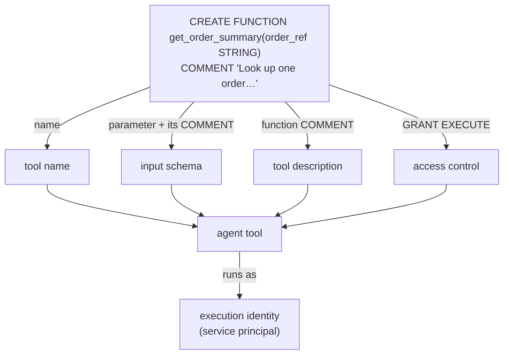
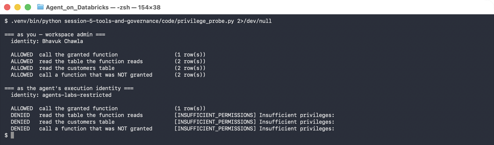

# Lab 5A — Build a Governed Tool from a Unity Catalog Function

**Session 5 · Tools and Governance**

> ✅ **Tested end-to-end.** A Unity Catalog function used as an agent tool, granted to a real service principal under least privilege. The identity **can call the function** and **cannot read the tables the function reads** — proven side by side in one probe.

## What you'll learn

- Why a UC function makes a better agent tool than hand-written SQL: **the signature is the schema and the `COMMENT` is the description**.
- What "execution identity" means, and how to give an agent one.
- The difference between **granting a function** and **granting the data behind it** — and why that gap is the whole point.
- The two-layer permission model that trips everyone up: UC grants are necessary but **not sufficient**.

## What you'll do

Create a function, grant a service principal `EXECUTE` on it and nothing else, then run the same four statements as yourself and as that principal and compare.

## Time & cost

- **Time:** ~40 minutes.
- **Cost:** a serverless SQL warehouse.

---

## Before you start

- **Permissions:** you need to create a service principal and grant UC privileges — account admin for the principal, `MANAGE` on the objects.
- **Compute:** a serverless SQL warehouse.
- **Data:** `agents_labs.retail`.

---

## The idea in 60 seconds

An agent tool needs three things: a name, an input schema, and a description telling the model when to use it. A Unity Catalog function already has all three.



There is no separate tool registry to keep in sync. **The function is the tool.**

---

## Step 1 — Write the function as a tool

**Goal:** make the comments carry their weight.

```sql
CREATE OR REPLACE FUNCTION agents_labs.retail.get_order_summary(
  order_ref STRING COMMENT 'Customer-facing order reference, e.g. ORD-1044'
)
RETURNS TABLE (order_id STRING, status STRING, item STRING, units INT,
               revenue DECIMAL(12,2), order_date DATE, region STRING, tier STRING)
COMMENT 'Look up one order: fulfilment status, item, units, revenue, and the region
         and loyalty tier of the customer who placed it. Use this whenever a question
         refers to a specific order reference.'
RETURN
  SELECT o.order_id, o.status, o.item, o.units, o.revenue, o.order_date, c.region, c.tier
  FROM agents_labs.retail.orders o
  JOIN agents_labs.retail.customers c USING (customer_id)
  WHERE o.order_id = order_ref;
```

**What this means.** Every comment has a job:

- the **parameter** comment becomes the argument description the model reads — *"e.g. ORD-1044"* is what stops it passing `1044`
- the **function** comment ends with *"Use this whenever…"*, which is routing guidance, not documentation

> ⚠️ **Gotcha — a function with no `COMMENT` is a tool with no description.** It will still be exposed, and the model will be guessing from the name alone. Write the comment as if it were a tool description, because it is one.

> 💡 **Note the second function.** `revenue_by_region(from_month)` returns aggregates and **no customer identifiers**. It exists to be *withheld* in Step 3 — a deliberately narrower capability the restricted identity is not granted.

---

## Step 2 — Give the agent an identity

**Goal:** stop the agent running as you.

```bash
databricks account service-principals create --display-name "agents-labs-restricted"
databricks account service-principal-secrets create <sp-id>
databricks service-principals create --application-id <app-id> --display-name "agents-labs-restricted"
```

> ⚠️ **Gotcha — service principal secrets are an *account-level* operation.** `databricks service-principal-secrets` does not exist at workspace level; the CLI suggests `service-principal-secrets-proxy` instead, which is a different thing. Create the principal **and** its secret at the account, then register the same `application_id` in the workspace.

> 🚨 **Gotcha — UC grants are necessary but not sufficient.** With every UC grant in place, the principal still failed:
>
> ```
> PermissionDenied: This API is disabled for users without the databricks-sql-access
> or workspace-access or workspace-consume entitlements.
> ```
>
> **Workspace entitlements are a separate layer from Unity Catalog privileges.** Grant them explicitly:
> ```python
> w.service_principals.patch(id=sp_id, operations=[Patch(op=PatchOp.ADD, path="entitlements",
>     value=[{"value":"databricks-sql-access"}, {"value":"workspace-access"}])], ...)
> ```
> The CLI's `patch --json` rejected the same payload with `Error in decoding the request`; the SDK accepted it.

The principal also needs `CAN_USE` on the warehouse. That is a third permission surface.

---

## Step 3 — Grant the function, withhold the data

**Goal:** the least-privilege grant, in three statements and two deliberate omissions.

```sql
GRANT USE CATALOG ON CATALOG agents_labs TO `<app-id>`;
GRANT USE SCHEMA ON SCHEMA agents_labs.retail TO `<app-id>`;
GRANT EXECUTE ON FUNCTION agents_labs.retail.get_order_summary TO `<app-id>`;

-- deliberately NOT granted:
--   SELECT ON TABLE agents_labs.retail.orders
--   SELECT ON TABLE agents_labs.retail.customers
--   EXECUTE ON FUNCTION agents_labs.retail.revenue_by_region
```

```console
$ SHOW GRANTS ON FUNCTION agents_labs.retail.get_order_summary
  a43d91d6-...  | EXECUTE | FUNCTION | agents_labs.retail.get_order_summary
```

---

## Step 4 — Prove the boundary

**Goal:** run the same four statements as two identities.

```bash
python code/privilege_probe.py
```



```console
=== as you — workspace admin ===
  identity: Bhavuk Chawla
  ALLOWED  call the granted function                  (1 row(s))
  ALLOWED  read the table the function reads          (2 row(s))
  ALLOWED  read the customers table                   (2 row(s))
  ALLOWED  call a function that was NOT granted       (2 row(s))

=== as the agent's execution identity ===
  identity: agents-labs-restricted
  ALLOWED  call the granted function                  (1 row(s))
  DENIED   read the table the function reads          [INSUFFICIENT_PERMISSIONS]
  DENIED   read the customers table                   [INSUFFICIENT_PERMISSIONS]
  DENIED   call a function that was NOT granted       [INSUFFICIENT_PERMISSIONS]
```

**What this means, and it is the point of the whole session.** The restricted identity **successfully called a function that reads two tables it cannot read**. Unity Catalog functions run with the **definer's** rights over the tables they touch, so the function is a controlled aperture: it returns one order, joined and shaped the way you decided, and nothing else.

Compare the two ways an agent could answer *"what's the status of ORD-1044?"*:

| | Reach |
|---|---|
| `SELECT … FROM orders JOIN customers` with `SELECT` granted | **every row of both tables**, forever |
| `get_order_summary('ORD-1044')` with `EXECUTE` granted | **one order**, with the columns you chose |

The agent only ever needed the second. Granting the first because it was easier is how an agent ends up able to exfiltrate a customer list.

> ⚠️ **Gotcha — the admin run is not a control, it is a warning.** Every line says ALLOWED because you are an admin. **Develop as the restricted identity**, or you will ship an agent that works in your hands and fails in production. Run this probe *before* wiring the tool into an agent, not after.

---

## Step 5 — Clean up

```bash
# the principal and its grants are removed with the catalog at course end;
# to remove just this identity:
databricks account service-principals delete <sp-id>
```

---

## What you learned

| You saw… | in Step | proof |
|---|---|---|
| A UC function supplies name, schema and description | 1 | parameter and function `COMMENT`s |
| A function without a comment is a tool without a description | 1 gotcha | the model guesses from the name |
| SP secrets are account-level, not workspace-level | 2 gotcha | CLI has no workspace command |
| UC grants alone are not enough | 2 gotcha | `databricks-sql-access` entitlement required |
| EXECUTE on a function ≠ SELECT on its tables | 4 | function ALLOWED, both tables DENIED |
| UC functions run with definer's rights | 4 | reads tables the caller cannot read |
| Developing as admin hides every boundary | 4 gotcha | admin run is ALLOWED four times |

## Evidence

[`artifacts/lab-5a/evidence/lab-5a-least-privilege.txt`](../artifacts/lab-5a/evidence/lab-5a-least-privilege.txt)
Source: [`code/privilege_probe.py`](code/privilege_probe.py), [`tools/setup/05_uc_functions.sql`](../tools/setup/05_uc_functions.sql), [`tools/setup/06_least_privilege.sql`](../tools/setup/06_least_privilege.sql).

---

**Next:** [Lab 5B — MCP Discovery, and Testing the Boundary](lab-5b-mcp-and-access-control.md)
