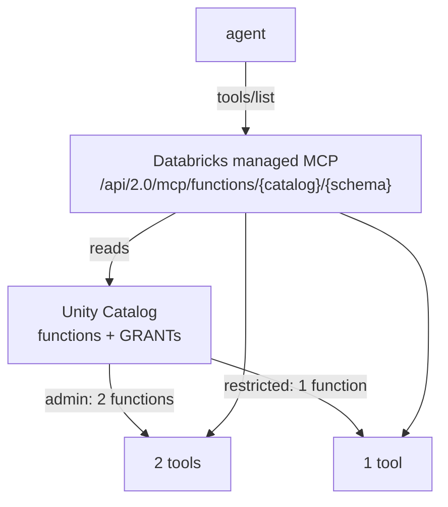
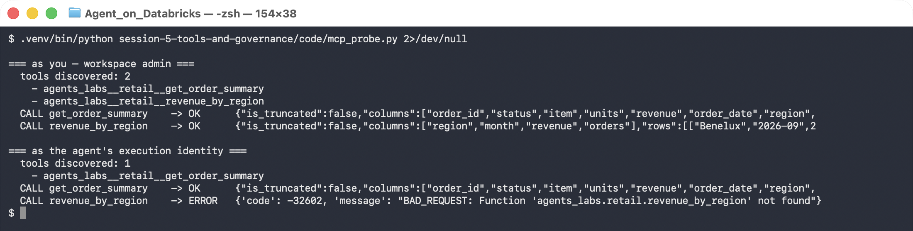

# Lab 5B — MCP Discovery, and Testing the Boundary

**Session 5 · Tools and Governance**

> ✅ **Tested end-to-end** against the Databricks **managed MCP server**. The admin identity discovers **2 tools**; the restricted identity discovers **1**. And when the restricted identity calls the tool it was not granted, the error is not *"forbidden"* — it is **`Function not found`**. It cannot learn the tool exists.

## What you'll learn

- What MCP gives you that a hand-written tool list does not: **discovery**.
- How Databricks exposes Unity Catalog functions as MCP tools with **zero extra configuration**.
- Why a governed tool catalog is filtered **per identity**, and why that is stronger than filtering per request.
- The difference between *denied* and *invisible*, and why the second is the better security posture.

## What you'll do

Query the managed MCP server as two identities, compare what each can see, then deliberately call a tool outside the restricted identity's scope and read exactly how it fails.

## Time & cost

- **Time:** ~30 minutes.
- **Cost:** a serverless SQL warehouse.

---

## Before you start

- **Prior labs:** [5A](lab-5a-governed-uc-function.md) — the functions, the service principal and the grants all come from there.
- **Environment:**
  ```bash
  export DATABRICKS_PROFILE=your-profile
  export LAB_HOST=https://<your-workspace>.azuredatabricks.net
  ```

---

## The idea in 60 seconds

Hand-written tool lists have a quiet failure mode: the list and the permissions drift apart. You remove someone's access to a function and forget to remove the tool, so the model keeps trying to call something it will always be refused.

MCP removes the second list. The server **is** the catalog, and it answers per caller.



---

## Step 1 — Discover tools, as yourself

**Goal:** see UC functions become MCP tools with no extra work.

```bash
curl -s -X POST "$LAB_HOST/api/2.0/mcp/functions/agents_labs/retail" \
  -H "Authorization: Bearer $TOKEN" -H "Content-Type: application/json" \
  -H "Accept: application/json, text/event-stream" \
  -d '{"jsonrpc":"2.0","id":1,"method":"tools/list","params":{}}'
```

**What you should see** — the schema is generated from the function signature:

```json
{"name": "agents_labs__retail__get_order_summary",
 "description": "Look up one order: fulfilment status, item, units, revenue, and the
                 region and loyalty tier of the customer who placed it. Use this
                 whenever a question refers to a specific order reference.",
 "inputSchema": {"type": "object", "required": ["order_ref"],
                 "properties": {"order_ref": {"type": "string",
                   "description": "Customer-facing order reference, e.g. ORD-1044"}}},
 "annotations": {"catalog": "agents_labs", "schema": "retail",
                 "routine_body": "SQL", "destructiveHint": true}}
```

**What this means.** The `COMMENT` you wrote in Lab 5A **is** the tool description. The parameter comment **is** the argument description. You did not write a tool schema; you wrote a function and documented it properly, and the schema is derived.

> ⚠️ **Gotcha — `destructiveHint: true` on a read-only function.** Databricks annotates SQL routines conservatively. `get_order_summary` only reads, yet it is flagged as potentially destructive. If your client uses that hint to decide what needs human approval, **every** UC function will prompt. Decide approval from your own policy — as [Lab 1B](../session-1-agent-architecture/lab-1b-minimal-agent.md) does with `needs_human()` — not from a hint you do not control.

---

## Step 2 — Discover as the restricted identity

**Goal:** watch the catalog shrink.

```bash
python code/mcp_probe.py
```



```console
=== as you — workspace admin ===
  tools discovered: 2
    - agents_labs__retail__get_order_summary
    - agents_labs__retail__revenue_by_region

=== as the agent's execution identity ===
  tools discovered: 1
    - agents_labs__retail__get_order_summary
```

**What this means.** Same endpoint, same catalog, same schema — **different tool list**. The restricted identity was granted `EXECUTE` on one function in Lab 5A, so it sees one tool. Nobody maintained a per-agent allowlist; the UC grant *is* the allowlist.

---

## Step 3 — Call the tool you were not granted

**Goal:** read the failure carefully, because the wording matters.

The probe calls both tools as both identities:

```console
=== as you — workspace admin ===
  CALL get_order_summary    -> OK      {"columns":["order_id","status","item",...
  CALL revenue_by_region    -> OK      {"columns":["region","month","revenue",...

=== as the agent's execution identity ===
  CALL get_order_summary    -> OK      {"columns":["order_id","status","item",...
  CALL revenue_by_region    -> ERROR   BAD_REQUEST: Function
                                       'agents_labs.retail.revenue_by_region' not found
```

**Read that last line again.** Not `PERMISSION_DENIED`. Not `403`. **`not found`.**

**What this means.** For the restricted identity, the function does not exist. It cannot be listed, called, or inferred. Compare the two postures:

| Response | What an attacker learns |
|---|---|
| `403 Forbidden` | the function exists, its exact name, and that access is worth pursuing |
| `not found` | nothing |

This is the harder and more valuable half of the session: the boundary is **proven enforced**, and enforced in the strongest available form. A configured-but-untested boundary is a hope.

> 🚨 **Gotcha — `not found` is indistinguishable from a typo, which is a real operational cost.** When an agent reports *"function not found"*, the cause is either a genuinely missing function **or** a missing grant, and the error will not tell you which. Diagnose by listing tools as the *agent's* identity, not yours. Expect this to cost someone an afternoon at least once.

---

## Step 4 — Why identity-filtered discovery beats request-time checks

**Goal:** understand what this design prevents.

A common pattern is to give the model every tool and check permissions when it calls one. That fails in three ways this design avoids:

1. **Wasted turns.** The model plans around a tool it can never use, calls it, gets refused, replans. Latency and tokens, every time.
2. **Information leak.** The tool list is in the prompt. A model that can be talked into repeating its instructions has just disclosed your internal capability catalogue — precisely the risk [Lab 1B's](../session-1-agent-architecture/lab-1b-minimal-agent.md) injection test probes.
3. **Drift.** Two sources of truth — the tool list and the grants — and nothing keeps them in step.

With MCP over UC, there is one source of truth and the model is never told about what it cannot use.

> 💡 **The Session 5 summary, in one line.** [Lab 5A](lab-5a-governed-uc-function.md) showed `EXECUTE` on a function is not `SELECT` on its tables. Lab 5B shows the agent cannot even *see* what it was not granted. Together: **the agent's capabilities are defined by UC grants, not by your prompt** — and that is the only place they can be defined safely.

---

## Step 5 — Clean up

Nothing to remove. The MCP server is a workspace endpoint, not a resource you created.

---

## What you learned

| You saw… | in Step | proof |
|---|---|---|
| UC functions become MCP tools with no configuration | 1 | schema generated from the signature |
| Your `COMMENT` is the tool description | 1 | comment text appears verbatim in `description` |
| `destructiveHint` is conservative and unreliable | 1 gotcha | `true` on a read-only function |
| Tool discovery is filtered per identity | 2 | 2 tools vs 1, same endpoint |
| The UC grant *is* the allowlist | 2 | no per-agent list was maintained |
| Out-of-scope calls fail as **not found** | 3 | `BAD_REQUEST: … not found` |
| Invisible is stronger than forbidden | 3 | a 403 confirms the target exists |
| `not found` hides typos too | 3 gotcha | list tools as the agent to diagnose |

## Evidence

[`artifacts/lab-5b/evidence/lab-5b-mcp-access-control.txt`](../artifacts/lab-5b/evidence/lab-5b-mcp-access-control.txt) — both identities, discovery and invocation.
Source: [`code/mcp_probe.py`](code/mcp_probe.py).

---

**Next:** [Lab 6A — Build an Evaluation Dataset and Get a Baseline](../session-6-evaluation-and-deployment/lab-6a-evaluation-dataset.md)
