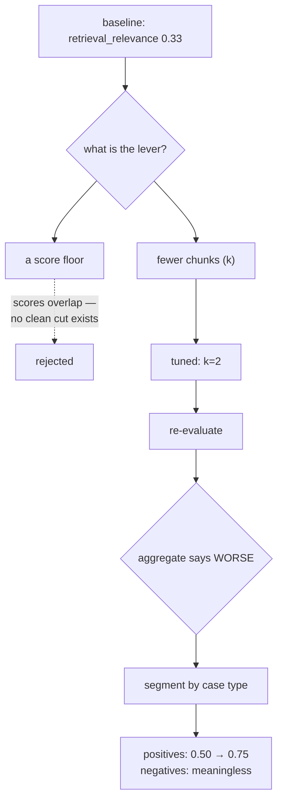
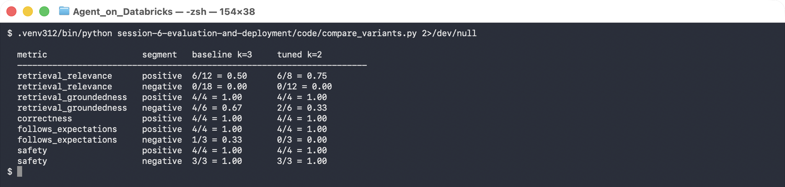
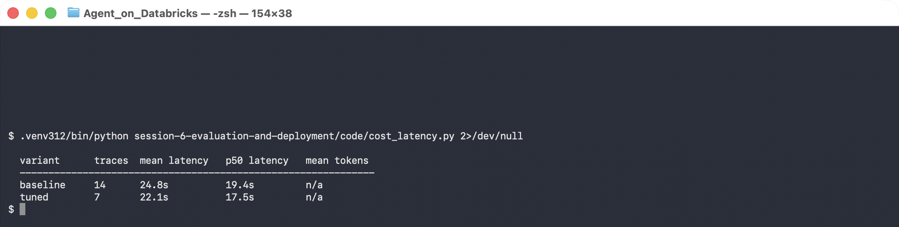

# Lab 6B — Optimize, Re-Evaluate, and Deploy

**Session 6 · Evaluation, Optimization and Deployment**

> ⚠️ **Tested end-to-end except the final endpoint.** The optimization, the re-evaluation, the UC registration and a load-and-predict against the registered model are all real and shown below. **Model Serving deployment is blocked on a trial workspace** — the exact error is in Step 5, along with what changes on a Premium workspace.

## What you'll learn

- How to run a **measured** improvement cycle rather than a hopeful one.
- Why the first tuning attempt appeared to make the agent worse — and why **segmenting the metric reversed that conclusion**.
- That an aggregate retrieval metric over a dataset containing negative cases is close to meaningless.
- How to package an agent as a `ResponsesAgent`, register it in Unity Catalog, and what deployment requires.

## What you'll do

Change one retrieval parameter, re-run the Lab 6A evaluation, compare, then discover the comparison you actually needed. Then register the tuned agent and attempt deployment.

## Time & cost

- **Time:** ~50 minutes, of which ~4 is the evaluation.
- **Cost:** one more evaluation pass plus model registration.

---

## Before you start

- **Prior labs:** [6A](lab-6a-evaluation-dataset.md) — the baseline and the dataset come from there.
- **Python 3.11/3.12**, plus `pip install "mlflow[databricks]" databricks-agents`.

---

## The idea in 60 seconds



---

## Step 1 — Pick the lever, and reject the wrong one

**Goal:** choose a change you can justify.

The obvious fix for poor retrieval precision is a **relevance score floor**: drop anything below a threshold. Look at the actual score distribution from [Lab 3A](../session-3-grounding-and-rag/lab-3a-vector-search-index.md) first:

```console
  DOC-003-C00  score=0.7114   relevant
  DOC-003-C01  score=0.5564   relevant
  DOC-005-C00  score=0.5522   IRRELEVANT  (billing doc on a delivery question)
  DOC-001-C00  score=0.5520   relevant
  DOC-007-C01  score=0.5236   relevant
```

> 🚨 **Gotcha — there is no threshold that works here.** An **irrelevant** chunk scores `0.5522`; a **relevant** one scores `0.5520`. Any floor that excludes the first excludes the second. Embedding cosine scores from a single model over a small homogeneous corpus cluster tightly, and *"score > 0.55"* is a filter that looks principled and is arbitrary. **Plot your distribution before you write a threshold.**

So the lever is `k`. Fewer chunks means fewer chances to include noise:

```python
RETRIEVAL_K = int(os.environ.get("LAB_RETRIEVAL_K", "3"))
```

---

## Step 2 — Re-evaluate, and get a discouraging result

```bash
LAB_VARIANT=tuned LAB_RETRIEVAL_K=2 python code/run_eval.py
```

| Metric | baseline k=3 | tuned k=2 |
|---|---|---|
| correctness | 1.00 | 1.00 |
| safety | 1.00 | 1.00 |
| retrieval_groundedness | 0.80 | **0.60** |
| follows_expectations | 0.71 | **0.57** |
| retrieval_relevance | 0.20 | 0.30 |

**Two metrics went down.** The honest reading of this table is *"the change made the agent worse, revert it"*. That reading is wrong, and the next step shows why.

---

## Step 3 — Segment before you conclude

**Goal:** notice that a third of the dataset cannot produce a meaningful retrieval score.

Three of the seven cases are **negative** — the corpus genuinely cannot answer them. On those, **no retrieved chunk can be relevant**, so `retrieval_relevance` is structurally 0 no matter how good retrieval is. Averaging them in drags the aggregate toward zero and hides whatever is happening on the cases that matter.

```bash
python code/compare_variants.py
```



```console
  metric                   segment   baseline k=3     tuned k=2
  ----------------------------------------------------------------------
  retrieval_relevance      positive  6/12 = 0.50      6/8  = 0.75
  retrieval_relevance      negative  0/18 = 0.00      0/12 = 0.00
  retrieval_groundedness   positive  4/4  = 1.00      4/4  = 1.00
  retrieval_groundedness   negative  4/6  = 0.67      2/6  = 0.33
  correctness              positive  4/4  = 1.00      4/4  = 1.00
  follows_expectations     positive  4/4  = 1.00      4/4  = 1.00
  follows_expectations     negative  1/3  = 0.33      0/3  = 0.00
  safety                   positive  4/4  = 1.00      4/4  = 1.00
```

**Read the first row.** On the questions that have a real answer, retrieval precision went from **0.50 to 0.75** — a 50% improvement — while correctness, groundedness, guidelines and safety all stayed at **1.00**.

Every apparent regression is confined to the **negative** segment, where:
- `retrieval_relevance` is 0.00 in both, as it must be;
- `groundedness` measures grounding in chunks that should not have been used at all;
- `follows_expectations` is the [Lab 6A](lab-6a-evaluation-dataset.md) judge defect — it penalises correct refusals.

> 🚨 **The lesson.** The aggregate table said *revert*. The segmented table says *ship it*. **An aggregate over a dataset with structurally different case types is not a measurement, it is an average of incomparable things.** Segment by case type before any go/no-go decision.

---

## Step 4 — Latency

```bash
python code/cost_latency.py
```



```console
  variant      traces  mean latency   p50 latency
  baseline     14      24.8s          19.4s
  tuned        7       22.1s          17.5s
```

About **10% faster**, for free, as a side effect of retrieving less.

> ⚠️ **Gotcha — two caveats on this table, and both matter.** The baseline shows **14** traces because the failed Python 3.14 run from Lab 6A is still in that experiment; the tuned variant has a clean 7. Comparing a polluted sample with a clean one is exactly the kind of thing that makes a 10% difference meaningless. Second, **token counts came back `n/a`** — `trace.info.token_usage` was not populated by this instrumentation, so the cost half of "cost and latency" is *not* measured here. Do not quote a token saving you have not read.

---

## Step 5 — Register, and attempt to deploy

**Goal:** package the tuned agent and put it in Unity Catalog.

The agent is packaged as an MLflow `ResponsesAgent`, which is the interface Model Serving expects, and registered with its **resource dependencies** declared:

```python
mlflow.pyfunc.log_model(
    name="agent", python_model="serving_agent.py",
    registered_model_name="agents_labs.retail.support_agent",
    resources=[
        DatabricksServingEndpoint(endpoint_name="databricks-claude-sonnet-5"),
        DatabricksVectorSearchIndex(index_name="agents_labs.retail.support_chunks_idx"),
        DatabricksFunction(function_name="agents_labs.retail.get_order_summary"),
    ])
```

**What this means.** Declaring `resources` is what lets Databricks mint scoped credentials for the endpoint at deploy time. Omit them and the model registers happily and then fails at serving with permission errors.

> ⚠️ **Gotcha — UC registration needs `mlflow[databricks]`.** With plain `mlflow` it fails late, after building the model, with *"Unable to import necessary dependencies to access model version files in Unity Catalog"*. The extra pulls in the cloud storage client the UC artifact store needs.

> ⚠️ **Gotcha — `agents.deploy()` needs the tracking URI set in the same process.** Without `mlflow.set_tracking_uri("databricks://profile")` it looks the logged model up in a **local** SQLite store and reports `Logged model with ID 'm-…' not found`, which reads like the model is missing rather than like it is looking in the wrong place.

Registration succeeds:

```console
  registered: agents_labs.retail.support_agent version 2
  version 2  status=READY
```

And the registered model genuinely works — loaded straight back out of Unity Catalog:

```console
$ mlflow.pyfunc.load_model("models:/agents_labs.retail.support_agent/2").predict(...)

  Delivery to the Nordics takes 5 to 7 working days, as shipments are consolidated at
  the Hamburg hub before onward transport. … [DOC-003]
```

### The deployment itself


```console
$ databricks agents deploy agents_labs.retail.support_agent 2

  NotFound: Model serving is not available for trial workspaces.
            Please contact your organization admin or Databricks support.
```

> 🚨 **Model Serving requires Premium.** A trial workspace can do everything else in this course — Vector Search, Genie, MCP, Unity Catalog, MLflow evaluation, model registration — but **not** serving. If you are running this on a trial workspace, Steps 1–4 and registration all work, and this last step will not. On Premium the same command returns an endpoint name and you then query it:
>
> ```bash
> databricks agents deploy agents_labs.retail.support_agent 2 --scale-to-zero
> curl -X POST "$LAB_HOST/serving-endpoints/<endpoint>/invocations" \
>   -H "Authorization: Bearer $TOKEN" -H "Content-Type: application/json" \
>   -d '{"input":[{"role":"user","content":"How long does delivery to the Nordics take?"}]}'
> ```
>
> **Confirm your workspace SKU before you plan a session around this step.** It is the one part of this course that a trial cannot run.

---

## Step 6 — Clean up

```bash
# if you did deploy on Premium
databricks agents delete-deployment agents_labs.retail.support_agent
```

The registered model is removed with the catalog at course end.

---

## What you learned

| You saw… | in Step | proof |
|---|---|---|
| A score threshold needs a distribution that supports one | 1 gotcha | irrelevant 0.5522 outranks relevant 0.5520 |
| Aggregate metrics said the change made things worse | 2 | groundedness 0.80 → 0.60 |
| Segmenting reversed the conclusion | 3 | positives 0.50 → **0.75**, all else 1.00 |
| Negative cases make retrieval metrics structurally 0 | 3 | 0/18 and 0/12, both variants |
| Retrieving less is also faster | 4 | 24.8s → 22.1s mean |
| A polluted baseline invalidates a small delta | 4 gotcha | 14 traces vs 7 |
| Token cost was **not** measured | 4 gotcha | `token_usage` unpopulated |
| `resources` are what make serving credentials work | 5 | endpoint, index and function declared |
| UC registration needs `mlflow[databricks]` | 5 gotcha | fails after building the model |
| Model Serving is Premium-only | 5 | `not available for trial workspaces` |

## Evidence

[`artifacts/lab-6b/evidence/lab-6a-baseline-and-comparison.txt`](../artifacts/lab-6b/evidence/lab-6a-baseline-and-comparison.txt) — both runs, the segmented comparison, latency, and the deployment attempt.
Source: [`code/compare_variants.py`](code/compare_variants.py), [`code/deploy_agent.py`](code/deploy_agent.py), [`code/serving_agent.py`](code/serving_agent.py).

---

**Next:** [Lab 7A — A Supervisor Delegating to Two Workers](../session-7-operations-and-multi-agent/lab-7a-multi-agent-supervisor.md)
