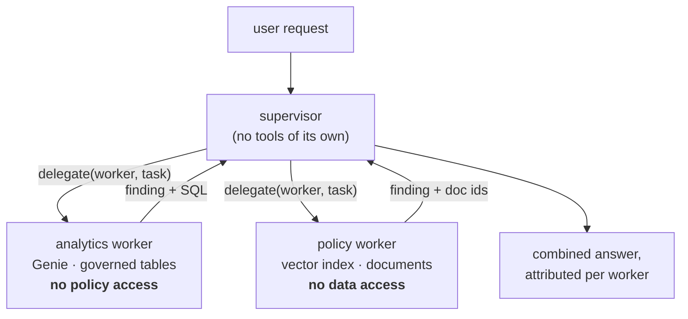
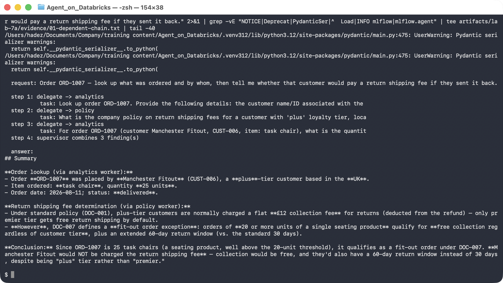
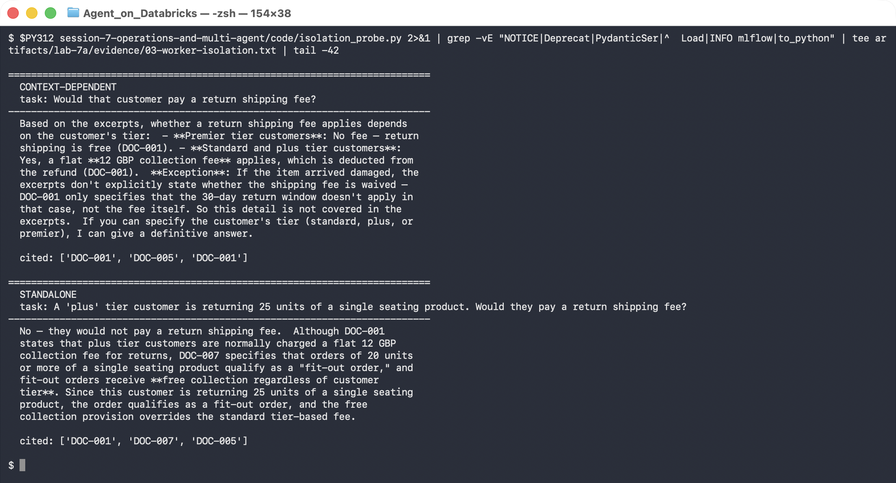
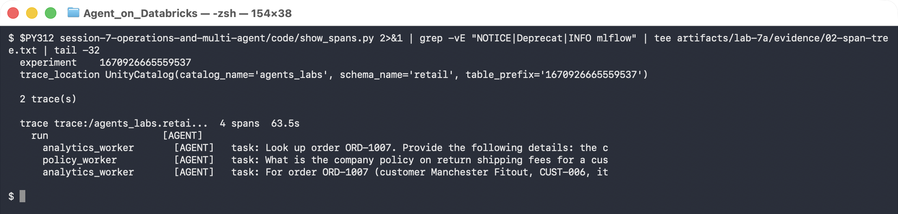

# Lab 7A — A Supervisor Delegating to Two Workers

**Session 7 · Operations and Multi-Agent Systems**

> ✅ **Tested end-to-end on Azure Databricks.** Every transcript and screenshot below is from a real run against `databricks-claude-sonnet-5`, the Lab 3A vector index, and the Lab 4A Genie space.

## What you'll learn

- How to split one agent into a **supervisor** and **specialist workers**, and what the split actually buys you.
- Why a worker must receive a **standalone** task — and what breaks when it doesn't, which is **not** what most people expect.
- How to read a multi-agent run from its MLflow **span tree**, which is the only practical way to debug one.
- The cost you pay for the pattern: latency multiplies with the number of hops.

## What you'll do

Run a supervisor that owns no tools of its own over two workers you already built — the Lab 3B policy retriever and the Lab 4B Genie analyst. Watch it discover mid-run that it needs a second fact from the first worker. Then deliberately send a badly-scoped task and see how the failure presents.

## Time & cost

- **Time:** ~45 minutes. Each supervisor run is 60–90 seconds of wall clock.
- **Cost:** 3–4 chat completions per run plus one Genie query and one vector search per delegation.

---

## Before you start

- **Prior labs:** [3A](../session-3-grounding-and-rag/lab-3a-vector-search-index.md) (the `support_chunks_idx` index), [3B](../session-3-grounding-and-rag/lab-3b-traced-rag-agent.md) (tracing to Unity Catalog), [4A](../session-4-genie/lab-4a-genie-space.md) and [4B](../session-4-genie/lab-4b-genie-in-an-agent.md) (the Genie space and the `ask` helper).
- **Environment:** Python 3.11 or 3.12 with `mlflow[databricks]`, `databricks-ai-search`, `databricks-sdk`, `openai`.

```bash
export DATABRICKS_PROFILE=agents-labs
export LAB_WAREHOUSE_ID=<your SQL warehouse id>
export LAB_GENIE_SPACE=<your Genie space id>
```

---

## The idea in 60 seconds



The supervisor cannot answer anything itself. That constraint is the design: it forces every fact in the final answer to come from a worker that is accountable for it.

---

## Step 1 — Read the two workers

**Goal:** see that "worker" is not a framework concept. It is a function with one job and one system prompt.

Open [`code/supervisor.py`](code/supervisor.py). The two workers are the top of the file:

| Worker | Capability | Deliberately lacks |
|---|---|---|
| `analytics_worker` | Genie over `agents_labs.retail` tables | any access to policy documents |
| `policy_worker` | vector search over `support_chunks_idx`, filtered to `audience: customer` | any access to order or customer data |

Both are decorated `@mlflow.trace(span_type="AGENT")`. That decorator is what makes the hand-offs visible in Step 4.

The supervisor gets exactly one tool:

```python
TOOLS = [{
    "type": "function",
    "function": {
        "name": "delegate",
        "description": "Delegate one self-contained sub-task to a specialist worker. "
                       "'analytics' can query governed order and customer data. "
                       "'policy' can search written company policy. "
                       "Neither can do the other's job.",
        ...
```

> 💡 **The tool description is the routing logic.** There is no router model and no classifier. The supervisor picks a worker by reading that description, which means an imprecise description produces mis-routing — and the fix is editing prose, not code.

---

## Step 2 — Run a request that needs both workers, in order

**Goal:** watch the supervisor discover a dependency it could not have planned for.

```bash
python session-7-operations-and-multi-agent/code/supervisor.py \
  "Order ORD-1007 — look up what was ordered and by whom, then tell me whether that customer would pay a return shipping fee if they sent it back."
```



The delegation sequence:

```console
  step 1: delegate -> analytics
           task: Look up order ORD-1007. Provide the following details: the c…
  step 2: delegate -> policy
           task: What is the company policy on return shipping fees for a cus…
  step 3: delegate -> analytics
           task: For order ORD-1007 (customer Manchester Fitout, CUST-006, it…
  step 4: supervisor combines 3 finding(s)
```

**Read step 3 carefully — it is the whole point of the lab.** The supervisor went *back* to the analytics worker. It did not plan three steps up front. The sequence was:

1. Ask analytics who placed ORD-1007 → *Manchester Fitout, CUST-006, plus tier, UK, task chair*.
2. Ask policy about return fees for a plus-tier UK customer → policy answers £12 flat fee, **but mentions DOC-007: orders of 20+ units of one seating product get free collection regardless of tier**.
3. The supervisor now knows a fact it did not know in step 1 changes the answer, and it does not know the quantity. So it re-delegates to analytics for the quantity → **25 units**.

The final answer:

> Since ORD-1007 is 25 task chairs (a seating product, well above the 20-unit threshold), it qualifies as a fit-out order under DOC-007. **Manchester Fitout would NOT be charged the return shipping fee** — collection would be free, and they'd also have a 60-day return window instead of 30 days, despite being "plus" tier rather than "premier."

A single-agent version of this with both tools attached would very likely have stopped after the £12 answer, because nothing would have prompted it to go looking for a quantity. The supervisor pattern didn't make the model smarter; it made the *gap between findings* explicit enough to act on.

> ⚠️ **This is emergent, not guaranteed.** Re-run it and the supervisor may take two steps instead of three and return the £12 answer. Nothing in the code forces the re-delegation. If a correct answer here matters, you encode the dependency — check quantity *before* quoting a fee — rather than hoping the supervisor rediscovers it. That is the Lab 7B argument for constrained flows over free delegation.

---

## Step 3 — Break a delegation on purpose

**Goal:** find out how a badly-scoped task actually fails. Most people guess wrong.

The supervisor prompt insists every task must stand alone:

```
* Each delegated task must stand alone. A worker sees only the task string,
  never the conversation and never another worker's findings.
```

Test what that rule is protecting you from:

```bash
python session-7-operations-and-multi-agent/code/isolation_probe.py
```

The script sends the same worker two versions of one question:

| | task |
|---|---|
| **Context-dependent** | `Would that customer pay a return shipping fee?` |
| **Standalone** | `A 'plus' tier customer is returning 25 units of a single seating product. Would they pay a return shipping fee?` |



**What did *not* happen:** the worker did not crash, and it did not say "I don't know who you mean."

```console
  CONTEXT-DEPENDENT
  Based on the excerpts, whether a return shipping fee applies depends on the
  customer's tier:
  - Premier tier customers: No fee — return shipping is free (DOC-001).
  - Standard and plus tier customers: Yes, a flat 12 GBP collection fee applies…
  cited: ['DOC-001', 'DOC-005', 'DOC-001']
```

```console
  STANDALONE
  No — they would not pay a return shipping fee.
  Although DOC-001 states that plus tier customers are normally charged a flat
  12 GBP collection fee, DOC-007 specifies that orders of 20 units or more of a
  single seating product qualify as a "fit-out order," and fit-out orders
  receive free collection regardless of customer tier…
  cited: ['DOC-001', 'DOC-007', 'DOC-005']
```

Compare the `cited` lines. **The vague task never retrieved DOC-007.**

The task string is the retrieval query. `"Would that customer pay a return shipping fee?"` contains no signal for *25 units* or *seating*, so the fit-out exception was never in the candidate set, so the worker could not have applied it. It then produced a fluent, correctly-cited, tier-accurate answer that is **the wrong answer for this customer** — and it looks completely trustworthy.

> ⚠️ **This is the failure mode that survives review.** A worker starved of context does not refuse. It answers the general question instead of the specific one, cites real documents for it, and hands back something a reviewer reading only the final answer will accept. In a multi-agent system the supervisor is that reviewer, and it has no way to know a document it never saw exists.
>
> Practical consequence: when a worker's task doubles as a retrieval query, **the supervisor's phrasing is a retrieval-quality problem, not a prose problem.** Put the concrete facts in the task string.

---

## Step 4 — Read the run from its span tree

**Goal:** debug a multi-agent run the only way that scales.

Printing from inside the supervisor works for one run on your laptop. It does not work for a run that happened yesterday in a job. The traces do:

```bash
python session-7-operations-and-multi-agent/code/show_spans.py
```



```console
  experiment    1670926665559537
  trace_location UnityCatalog(catalog_name='agents_labs', schema_name='retail',
                              table_prefix='1670926665559537')

  2 trace(s)

  trace trace:/agents_labs.retai...  4 spans  63.5s
    run                    [AGENT]
      analytics_worker       [AGENT]   task: Look up order ORD-1007. Provide the following details: the c
      policy_worker          [AGENT]   task: What is the company policy on return shipping fees for a cus
      analytics_worker       [AGENT]   task: For order ORD-1007 (customer Manchester Fitout, CUST-006, it
```

Three things this gives you that stdout does not:

1. **The task strings are stored.** Step 3 proved the task string determines retrieval quality. The span tree is where you audit it after the fact.
2. **The hop count and duration.** 63.5 seconds for three delegations. Each hop is a full model round-trip plus the worker's own model call — roughly 6 model calls for one user question.
3. **It is a Delta table.** `trace_location` is Unity Catalog, so "how often does the supervisor re-delegate to the same worker?" is a SQL query over `1670926665559537_otel_spans`, not a log-grep.

> 💡 **Gotcha in the reader, worth knowing.** `span.inputs` comes back as a **dict** for some spans and as the **JSON text** of one for others. `show_spans.py` handles both:
> ```python
> ins = s.inputs
> if isinstance(ins, str):
>     try: ins = json.loads(ins)
>     except Exception: ins = {"task": ins}
> ```
> The first version of this script crashed with `AttributeError: 'str' object has no attribute 'get'`. Don't assume the shape.

---

## Step 5 — Weigh the pattern honestly

**Goal:** be able to say when *not* to do this.

| | Single agent, both tools | Supervisor + workers |
|---|---|---|
| Latency for the ORD-1007 question | one loop, ~25s | **63.5s**, 3 hops |
| Model calls | ~3 | ~6 |
| Accountability | one context holds everything | each fact traces to a named worker |
| Governance | one identity needs every grant | each worker can run as its own principal |
| Prompt size | grows with every tool added | each worker's prompt stays small |
| Failure mode | tool confusion | **silent context starvation** (Step 3) |

The supervisor pattern is worth it when **the workers need different privileges** — the analytics worker touching governed tables under a principal that has no business reading internal-only policy documents is a real separation, enforced by Unity Catalog rather than by a prompt. Revisit [Lab 5B](../session-5-tools-and-governance/lab-5b-mcp-and-access-control.md): each worker can be a distinct service principal, and MCP tool discovery is identity-filtered, so a worker literally cannot see tools it isn't granted.

It is **not** worth 2.5× the latency purely to tidy up your prompts.

---

## What you learned

| You saw… | in Step | proof |
|---|---|---|
| Routing is the tool description, not a classifier | 1 | one `delegate` tool, `enum` of two workers |
| A supervisor can re-delegate after learning a new fact | 2 | step 3 returns to `analytics` for the quantity |
| The correct answer inverted the naive one | 2 | £12 fee → **free**, via DOC-007 |
| The re-delegation is emergent, not guaranteed | 2 gotcha | nothing in code forces it |
| A starved worker answers confidently instead of refusing | 3 | fluent, cited, wrong-for-this-case |
| The task string *is* the retrieval query | 3 | `DOC-007` absent from `cited` in the vague run |
| Span trees record every task string | 4 | 4 spans, task text per worker |
| Traces land in a UC Delta table | 4 | `trace_location` = `agents_labs.retail` |
| `span.inputs` is dict *or* JSON text | 4 gotcha | `AttributeError` on the first attempt |
| The pattern costs ~2.5× latency | 5 | 63.5s vs ~25s single-agent |

## Evidence

- [`artifacts/lab-7a/evidence/01-dependent-chain.txt`](../artifacts/lab-7a/evidence/01-dependent-chain.txt) — the three-delegation run in full.
- [`artifacts/lab-7a/evidence/02-span-tree.txt`](../artifacts/lab-7a/evidence/02-span-tree.txt) — span tree and UC trace location.
- [`artifacts/lab-7a/evidence/03-worker-isolation.txt`](../artifacts/lab-7a/evidence/03-worker-isolation.txt) — both phrasings, both citation sets.

Source: [`code/supervisor.py`](code/supervisor.py), [`code/isolation_probe.py`](code/isolation_probe.py), [`code/show_spans.py`](code/show_spans.py).

---

**Next:** [Lab 7B — Agent Bricks, Versioning and Safe Rollout](lab-7b-rollout-and-agent-bricks.md)
