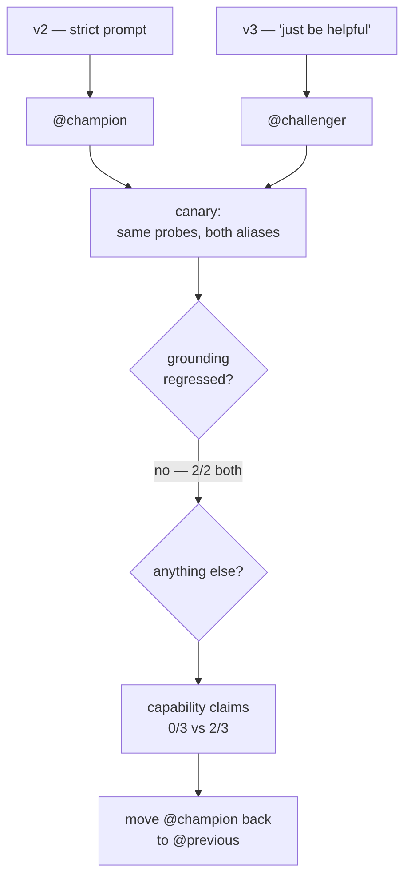

# Lab 7B — Versioning, Canaries and Safe Rollback

**Session 7 · Operations and Multi-Agent Systems**

> ✅ **Steps 1–4 tested end-to-end on Azure Databricks.** Three model versions, real aliases, real predictions loaded from Unity Catalog, real promote and rollback.
>
> ⚠️ **Step 5 (Agent Bricks) is a walkthrough, not an exercise.** Agent Bricks has no REST API, its UI page does not resolve on a trial workspace, and it provisions a Model Serving endpoint underneath, which a trial also refuses. Step 5 shows all three. Nothing in that step is presented as tested.

## What you'll learn

- Why callers should reference a **model alias**, never a version number.
- How to canary a candidate against the incumbent by loading both from Unity Catalog.
- That **a one-run canary is a coin flip** — the regression in this lab appears 2 times in 3.
- That the regression you find is often not the one you went looking for.
- How to roll back in one pointer move, and what you must record at promotion time to make that possible.

## What you'll do

Register a second version of the Lab 6B agent with one line of its prompt loosened, alias the two versions champion and challenger, canary them, measure how reliably the regression reproduces, then promote and roll back.

## Time & cost

- **Time:** ~55 minutes. The repeat canary in Step 3 is ~6 minutes of model calls.
- **Cost:** one model registration plus roughly 12 agent predictions.

---

## Before you start

- **Prior labs:** [6B](../session-6-evaluation-and-deployment/lab-6b-optimize-and-deploy.md) — `agents_labs.retail.support_agent` version 2 must exist and be `READY`.
- **Environment:** Python 3.11 or 3.12 with `mlflow[databricks]`, `databricks-ai-search`, `databricks-sdk`, `openai`.

```bash
export DATABRICKS_PROFILE=agents-labs
export LAB_WAREHOUSE_ID=<your SQL warehouse id>
```

Confirm the incumbent is there:

```bash
python session-7-operations-and-multi-agent/code/rollout.py status
```

---

## The idea in 60 seconds



---

## Step 1 — Register a candidate and name the versions

**Goal:** stop callers from depending on version numbers.

The candidate is [`code/serving_agent_v3.py`](code/serving_agent_v3.py). Diff it against the Lab 6B agent and the only functional change is three lines:

```diff
-SYSTEM = ("You are a support agent for an office furniture retailer. Answer only from "
-          "the policy excerpts you retrieve. If they do not cover the question, say so. "
-          "Cite the document id you relied on, like [DOC-003].")
+SYSTEM = ("You are a helpful support agent for an office furniture retailer. "
+          "Use the policy excerpts you retrieve. Always give the customer a useful, "
+          "confident answer. Cite a document id like [DOC-003] where you can.")
```

This is a realistic change, not a strawman. It is what gets requested after someone reads a week of refusals in the logs and asks for the agent to stop saying "I don't know". Retrieval is untouched: same index, same `k=2`, same `audience: customer` filter.

```bash
python session-7-operations-and-multi-agent/code/register_candidate.py
```


```console
  registered agents_labs.retail.support_agent version 3
  READY versions: [3, 2]   incumbent: v2   candidate: v3

  @champion   -> v2
  @challenger -> v3

  callers load 'models:/agents_labs.retail.support_agent@champion' and never a version number
```

> 💡 **Note the `READY` filter.** The script picks the incumbent from versions whose `status == "READY"`. This workspace also holds a **version 1 stuck in `PENDING_REGISTRATION`** from an earlier failed attempt. A script that naively took "the highest version below the new one" would have aliased `@champion` to a model that cannot be loaded. Failed registrations do not disappear; they sit in the version list forever.

---

## Step 2 — Canary the challenger against the champion

**Goal:** compare two versions on the probes that matter, not the ones that are easy.

```bash
python session-7-operations-and-multi-agent/code/canary.py
```

Three probes. One is answerable from the customer-visible documents. **Two are not** — their answers live in `DOC-006`, which is tagged `audience: agent_only` and filtered out of retrieval, so the correct behaviour is to refuse.


```console
                refusals   promises    words
  champion    2/2        0/3             107
  challenger  2/2        0/3             373

  grounding:  unchanged
  capability claims: 0 -> 0
  verbosity:  107 -> 373 words (3.5x)
```

**The grounding did not regress.** Both versions correctly refused both ungrounded probes. The hypothesis going in — that "always give a confident answer" would make the agent invent a refund limit — was simply wrong. Retrieval-grounded refusal turned out to be robust to that prompt edit.

> ⚠️ **Gotcha: the first version of this canary reported `0/2` refusals for *both* models — and it was the detector that was broken, not the agents.**
>
> The original refusal test was a short substring list: `"couldn't find"`, `"do not cover"`, `"not specified"`. The champion actually said *"The provided policy excerpts **don't mention** a refund approval limit"* and the challenger said *"I **wasn't able to find** any information"*. Neither phrasing was in the list, so two correct refusals were scored as failures.
>
> This is [Lab 6A's](../session-6-evaluation-and-deployment/lab-6a-evaluation-dataset.md) lesson arriving a second time: **a cheap judge fails in the direction of reporting problems that are not there.** Had the run been read at face value, the conclusion would have been "both versions hallucinate" and someone would have spent a day fixing an agent that was already correct.
>
> The fixed detector is a deliberately wide regex, and the reasoning is in a comment in [`canary.py`](code/canary.py). Before you trust *any* automated check on agent output, feed it text you have read yourself and confirm it agrees with you.

So the canary found nothing on the axis it was designed for. It found something on another axis. Look at the words column: **3.5× longer answers.** Reading those answers, the challenger volunteers things like:

> I can escalate this to our customer resolutions team, who handle compensation decisions on a case-by-case basis… **Would you like me to escalate this for you?**

The agent has exactly two capabilities: retrieve policy text, and look up an order summary. **It cannot escalate anything.** It has no tool for it, no queue to write to, and no team on the other end. A customer told "I've escalated this" by an agent that did nothing is a worse outcome than a refusal.

This is why `canary.py` also runs a second regex, `CAPABILITY`, over every answer. Grounding asks *is this fact true?* Capability asks *is this offer real?* No groundedness scorer will catch the second one, because the sentence contains no factual claim to be ungrounded.

---

## Step 3 — Run the canary again. And again.

**Goal:** find out whether your gate is measuring behaviour or luck.

In Step 2 the capability check came back `0/3` for both. In the run before it, the same probe against the same version produced the escalation offer. Same model, same prompt, same `k`. So which is it?

```bash
python session-7-operations-and-multi-agent/code/canary_repeat.py
```


```console
  probe: What discount can you give me if I complain about a late delivery?
  runs:  3 per alias

  champion    run 1    56 words  refused  clean
  champion    run 2    60 words  refused  clean
  champion    run 3    57 words  refused  clean

  challenger  run 1   115 words  refused  clean
  challenger  run 2   176 words  refused  PROMISES "escalate this for"
  challenger  run 3   140 words  refused  PROMISES "escalate this for"

               capability claims   mean words
  champion    0/3                           58
  challenger  2/3                          144

  A pass/fail gate on ONE run of the challenger would have said FAIL with
  probability 2/3.
```

Read the champion column first. **56, 60, 57 words — and clean every time.** The strict prompt is not just safer on average, it is *stable*. The challenger ranges 115–176 words and offers a capability it does not have in two runs out of three.

Two conclusions, and the second is the operational one:

1. The regression is real. A one-in-three chance of promising a customer an escalation that never happens is not shippable.
2. **A single-run canary gate would have passed this change one time in three.** Whether the release went out would have depended on which sample the gate happened to draw. That is not a gate; it is a coin weighted 2:1.

> ⚠️ **Do not build a release gate on n=1.** Non-determinism is not noise you can average away later — it is the property you are gating on. If a behaviour appears in 33% of runs it will appear in 33% of customer conversations. Set your probe count from the rate you are willing to ship, and record the rate rather than a pass/fail bit.
>
> Three runs is enough to see this effect and far too few to bound it. `LAB_CANARY_RUNS=10` is a more honest number and costs ten predictions.

---

## Step 4 — Promote, then roll back

**Goal:** make the rollback a pointer move.

```bash
python session-7-operations-and-multi-agent/code/rollout.py promote
python session-7-operations-and-multi-agent/code/rollout.py rollback
```


```console
### rollout.py promote
  recorded @previous  -> v2
  promoted @champion  -> v3
    @champion    -> v3
    @challenger  -> v3
    @previous    -> v2

### rollout.py rollback
  rolled back @champion  v3 -> v2
    @champion    -> v2
    @challenger  -> v3
    @previous    -> v2

    caller URI (never changes): models:/agents_labs.retail.support_agent@champion
```

Three things to take from this:

**The caller URI never changed.** Every consumer loads `models:/agents_labs.retail.support_agent@champion`. Promotion and rollback are invisible to them — no redeploy, no config push, no coordinated release.

**`@previous` is written at promotion time, not at rollback time.** This is the part teams skip. If you only set `@champion`, then at 02:00 during an incident "roll back" means "find out what was running before", and the answer lives in someone's memory or a chat scrollback. Recording the outgoing version *as you replace it* is what makes the rollback a single command:

```python
if ch:
    c.set_registered_model_alias(UC_MODEL, "previous", ch)
c.set_registered_model_alias(UC_MODEL, "champion", cl)
```

**`@challenger` deliberately still points at v3.** The candidate is not deleted on rollback. The prompt change was well-motivated — the refusals someone complained about are real. What failed was this *implementation* of it. Keeping v3 aliased means the next attempt starts from a named artefact with a canary record attached, rather than from scratch.

> 💡 **Aliases are Unity Catalog objects, so they are governed and audited.** Who moved `@champion` and when is in the UC audit log. This is the practical difference between an alias and a config file in a repo.

---

## Step 5 — Agent Bricks: what it is, and why this workspace cannot run it

**This step is reference material. It was not executed.** Here is the proof, rather than an assertion:


```console
  Agent Bricks REST surface on this workspace:
    /api/2.0/agent-bricks/knowledge-assistant/list       404
    /api/2.0/knowledge-assistant/list                    404
    /api/2.0/agent-bricks/supervisor/list                404
    /api/2.0/agents/list                                 404

  what Agent Bricks needs underneath — a serving endpoint:
    NotFound: Model serving is not available for trial workspaces.
    Please contact your organization admin or Databricks support.
```

And the UI says the same thing. The **Agents** entry is present in the AI/ML section of the left nav, but opening it lands on `/ml/bricks`, which does not exist on this workspace:


> 💡 **A nav entry is not a feature.** The link is rendered from the static navigation, not from what the workspace has provisioned, so it appears whether or not Agent Bricks is available to you. If you are checking whether a workspace can run this step, open the page — do not go by the sidebar.

Three independent blockers:

1. **The UI page does not resolve** on a trial workspace, as above.
2. **No REST API.** Agent Bricks is configured in the workspace UI only. There is nothing to script, which also means nothing to put in a lab that runs from a terminal.
3. **It needs Model Serving.** Every Agent Bricks agent is backed by a serving endpoint, and a trial workspace refuses to create one — the same wall [Lab 6B](../session-6-evaluation-and-deployment/lab-6b-optimize-and-deploy.md) Step 5 hit.

**What Agent Bricks gives you**, for an instructor to demo on a Premium workspace:

| | Agent Bricks | What you built in 7A |
|---|---|---|
| Authoring | UI form: pick documents, describe the task | Python, explicit tool schemas |
| Supervisor | **Supervisor Agent** brick composes other agents | `supervisor.py` and a `delegate` tool |
| Retrieval agent | **Knowledge Assistant** brick over a UC volume or table | Lab 3A index + Lab 3B agent |
| Quality loop | built-in evaluation and auto-optimization | Lab 6A dataset + `mlflow.genai.evaluate()` |
| Rollout | managed endpoint versions | the UC aliases in Step 4 |
| Ceiling | the brick's own configuration surface | anything you can write |

**The walkthrough**, on a Premium or Enterprise workspace:

1. **Agents → Agent Bricks → Knowledge Assistant.** Point it at `agents_labs.retail.support_docs`, describe the audience, give it the same instruction the strict prompt uses.
2. **Add a Supervisor Agent.** Register the Knowledge Assistant as one sub-agent and the Lab 4A Genie space as another. This is the 7A architecture with the routing prompt generated for you.
3. **Attach the Lab 6A dataset** as the evaluation set. Agent Bricks will optimize against it.
4. **Version and roll out** through the endpoint's own version list.

> ⚠️ **What does *not* change when you move to Agent Bricks.** Everything in Steps 2 and 3 of this lab still applies, and the platform does not do it for you:
> - The built-in quality loop scores **grounding**. It does not know that your agent has no escalation tool, so it will not flag the capability claim from Step 2.
> - Its evaluation runs once per candidate. The Step 3 result — a regression appearing 2 times in 3 — is exactly what a single scored run misses.
>
> Agent Bricks removes the authoring work. It does not remove the need to decide what "worse" means for your agent and to measure it more than once.

**Region availability:** Knowledge Assistant and Supervisor Agent were confirmed available in `eastus`, where this workspace lives. Availability is per-region and changes; check the current Databricks region support matrix before planning a session around it.

---

## Step 6 — Leave the aliases in a sane state

```bash
python session-7-operations-and-multi-agent/code/rollout.py status   # expect @champion -> v2
```

`@champion` must point at v2 for the capstone. The model and its aliases are removed with the catalog at course end — see [`TEARDOWN.md`](../TEARDOWN.md).

---

## What you learned

| You saw… | in Step | proof |
|---|---|---|
| Callers reference an alias, never a version | 1, 4 | one URI across promote and rollback |
| Failed registrations linger in the version list | 1 gotcha | v1 stuck `PENDING_REGISTRATION` |
| The prompt change did **not** break grounding | 2 | refusals 2/2 for both versions |
| A narrow refusal detector invented a regression | 2 gotcha | `0/2` for two correct refusals |
| The real regression was **hallucinated capability** | 2 | "Would you like me to escalate this for you?" |
| Groundedness scorers cannot catch a false offer | 2 | no factual claim to be ungrounded |
| Verbosity tripled on the same probes | 2 | 107 → 373 words |
| The regression is intermittent | 3 | **2/3** runs, champion 0/3 |
| A one-run gate would pass it 1 time in 3 | 3 | stated in the script output |
| The strict prompt was also more *stable* | 3 | champion 56/60/57 words |
| Rollback needs `@previous` written at promote time | 4 | `recorded @previous -> v2` |
| Aliases are governed UC objects | 4 | audit log records who moved them |
| The Agents nav entry exists but the page does not | 5 | `/ml/bricks` → Page not found |
| Agent Bricks has no REST API | 5 | four 404s |
| Agent Bricks needs serving, blocked on trial | 5 | `not available for trial workspaces` |

## Evidence

- [`artifacts/lab-7b/evidence/01-register-and-alias.txt`](../artifacts/lab-7b/evidence/01-register-and-alias.txt) — registration and initial aliases.
- [`artifacts/lab-7b/evidence/02-canary.txt`](../artifacts/lab-7b/evidence/02-canary.txt) — all six answers in full.
- [`artifacts/lab-7b/evidence/03-canary-repeat.txt`](../artifacts/lab-7b/evidence/03-canary-repeat.txt) — the 2/3 reproduction rate.
- [`artifacts/lab-7b/evidence/04-promote-rollback.txt`](../artifacts/lab-7b/evidence/04-promote-rollback.txt) — alias state at each stage.
- [`artifacts/lab-7b/evidence/05-agent-bricks-availability.txt`](../artifacts/lab-7b/evidence/05-agent-bricks-availability.txt) — the API and serving probes.

Source: [`code/register_candidate.py`](code/register_candidate.py), [`code/canary.py`](code/canary.py), [`code/canary_repeat.py`](code/canary_repeat.py), [`code/rollout.py`](code/rollout.py), [`code/serving_agent_v3.py`](code/serving_agent_v3.py).

---

**Next:** [Capstone — Build and Defend Your Own Agent](../capstone/capstone-brief.md)
